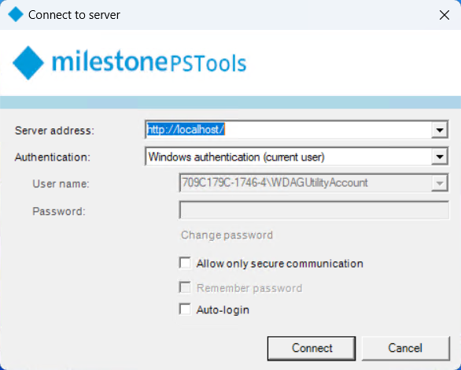

# Introducing connection profiles and custom attributes

## MilestonePSTools 23.2.2 now available

The latest version of MilestonePSTools was published yesterday and you can get your \[code\]signed copy on the
[PowerShell Gallery](https://www.powershellgallery.com/packages/MilestonePSTools/23.2.2). Rather than echo the
[changelog](../../../changelog.md), this post will elaborate on a couple of the changes I'm most excited about!

<!-- more -->

## Connection profiles

### What is a connection profile?

A connection profile in MilestonePSTools contains the information needed to login to your VMS so you don't have to type
it in every time. To create, and use a connection profile, use `Connect-Vms` instead of `Connect-ManagementServer`.

Connection profiles are stored by name, and the default profile name is "default". The first time you run the `Connect-Vms`
command without any other parameters, we'll check to see if a connection profile named "default" exists. When that profile
isn't found, you'll be prompted with a login dialog like the one below. After successfully connecting, the details you used
to login to your VMS are saved securely in your Windows user profile. The next time you use `Connect-Vms`, it will find
the saved profile named "default" and attempt to login to that site with the same credentials and options as before.



If you login to more than one management server from the same computer and Windows user account, instead of using the
default profile, you can create a named profile for each server by using the `-Name` parameter. For example, `Connect-Vms -Name vms1`
and `Connect-Vms -Name vms2`. The `-Name` parameter is positional, so you can also simply use `Connect-Vms vms1`.

### Why do I need them?

From the first release of MilestonePSTools, the command used to login to your management server has been `Connect-ManagementServer`,
and you were required to run it before running a command or script against that server. And unless you are using the module
directly on the management server, you would also need to provide a server address, possibly a Windows or Basic User credential,
and maybe a couple switches like `-BasicUser`, `-IncludeChildSites`, or `-SecureOnly` depending on your environment.

This can get a bit tedious if you often find yourself working with Milestone from the terminal. And if you've set up
scripts for automation before, you've probably had to figure out how to store and retrieve your VMS credential and connection
settings. One of my favorite tools for this is the [Microsoft.PowerShell.SecretManagement module](https://github.com/PowerShell/SecretManagement), but many MilestonePSTools users are new to PowerShell and setting up secret management can be a tedious
and unrewarding task.

By using `Connect-Vms` and creating a default, or named connection profile...

- You eliminate the need to either supply login details in the terminal or use `-ShowDialog` on every login.
- You'll be automatically logged in to the default connection profile if you forget to login and run a command like
  `Get-VmsCameraReport`, and if the default profile doesn't exist, you'll be automatically prompted with a login dialog.
- You can setup a [scheduled task](../../../examples/automation-with-task-scheduler.md) and not worry about writing (and
  troubleshooting) code to store and retrieve the login details securely. Just create a connection profile, and as long
  as your scheduled task runs as the same Windows user that created the connection profile, your scheduled script can
  login with a simple `Connect-Vms` or `Connect-Vms MyNamedProfile`.
- If you frequently connect to several management servers, you can use named profiles for each of them and easily run a
  script or generate a report against each site, even if they aren't setup in a Milestone Federated Hierarchy (MFA).

Ultimately they are a convenience feature to remove a little friction from your MilestonePSTools experience. If you prefer
not to use them, you can still use `Connect-ManagementServer`, or you can use the "ServerAddress" parameter set on
`Connect-Vms` which looks very similar and will not store a connection profile for you.

```powershell
Connect-Vms -ServerAddress http://management1 -Credential (Get-Credential) -BasicUser -SecureOnly -AcceptEula # (1)!
```

1. Unlike `Connect-ManagementServer`, `Connect-Vms` never requires you to use `-Force` to logout if you're already logged in to a server, and after a successful connection it returns a `VideoOS.Platform.ConfigurationItems.ManagementServer` object.

### How do they work?

The first time you use `Connect-Vms` without parameters, you will be prompted with the same MilestonePSTools login dialog
you see when using `Connect-ManagementServer -ShowDialog`. After a successful login, the server address, credential (if provided),
and other options supplied during logon are stored in your local AppData directory under the MilestonePSTools folder. From
a PowerShell terminal, you can run `#!powershell Start-Process $env:LOCALAPPDATA\MilestonePSTools\credentials.xml` to open
the file.

The `credentials.xml` file is generated by exporting a hashtable of connection profiles using the `Export-CliXml` cmdlet
which automatically serializes the `[PSCredential]` representing your Windows or Basic User credentials such that the password
is encrypted.

When you use `Connect-Vms` again after a connection profile has been saved, the `credentials.xml` file is imported and if
the named (or default) profile exists, the parameters used to login previously will be used to login again.

## Custom attributes

For a detailed write-up on the custom attributes added to MilestonePSTools, check out the [about_Custom_Attributes](../../../commands/en-US/about_Custom_Attributes.help.md) article.

To summarize that article, attributes are used in many programming languages as a tool to add documentation and/or behavior
to parts of your code. I wanted to simplify the developer experience for MilestonePSTools, and improve the consistency and
quality of some common errors. When a command is used but the requirements are not met, the command will fail early with
a clear and consistent error message.

### Better documentation

A side-benefit of the new custom attributes is that the requirements declared by these attributes are now used to
automatically add information to the documentation. Check out [`Get-VmsFailoverRecorder`](../../../commands/en-US/Get-VmsFailoverRecorder.md#description) for an example with three different requirements:

1. Requires a VMS connection
2. Requires VMS version 21.2 or later
3. Requires the feature "RecordingServerFailover"

As a part of the automated build process for the MilestonePSTools module, all commands are checked for the presence of
a "requirement" attribute, and each requirement is automatically added or updated. If the minimum version for a command
changes, or another requirement is added, the documentation will always be up to date.

### Automatic login

Another neat feature of the `[MilestonePSTools.RequiresVmsConnection()]` attribute is that if you haven't logged in to
your management server yet, the `Validate()` method on the attribute will _automatically_ attempt to get you connected
before throwing an error. That means when you use a command like `Get-VmsCameraReport` before logging in, you won't get
an error right away. Instead, the attribute will run `Connect-Vms` which will log you in using the default connection
profile, or present you with a login dialog. You'll only see a `VmsNotConnectedException` error if you click cancel on
the login dialog.

