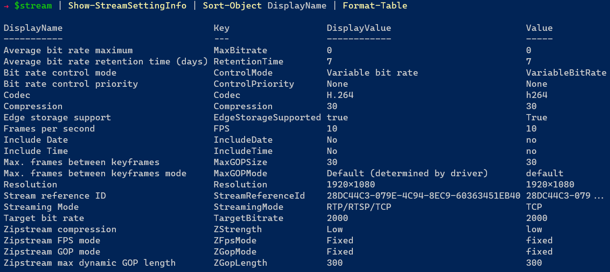

# All About Stream Settings



If you've never struggled with the difference between "H.264" and "h264" or "true" and "True", then you've never used [`#!powershell Set-VmsCameraStream`](../../../commands/en-US/Set-VmsCameraStream.md). Read on to learn about stream settings and how to configure them from PowerShell so that you can spend less time interpreting validation errors and more time on the important things.

<!-- more -->

## Introduction

Milestone supports _a lot_ of devices, and most of these supported devices are implemented as "device drivers" which are installed as a part of a "Milestone XProtect VMS Device Pack". Each device pack driver enables support for one or more devices. Most of the time a single device pack driver provides support for a whole series of hardware models. For example nearly every modern Axis camera should be using the "AXIS" driver, and during hardware discovery the driver will build a unique _hardware definition_ for each device based on the capabilities discovered. The capabilities reported by the camera can even change over time as firmware is upgraded, or device packs are upgraded.

This implementation enables a lot of flexibility around device driver development as there are very few constraints around what _can_, or _must_ be implemented. If a new type of codec or stream-related feature arrives on the market, we're able to add support for that new feature on specific drivers without having to update all the device drivers that came before. We saw this several years ago with the introduction of "smart codecs" like [Axis Zipstream](https://www.axis.com/solutions/zipstream).

The tradeoff for this flexibility is consistency from driver to driver. Since every driver is free to define it's own set of properties for each camera, it leaves room for inconsistency in the names or supported values from one driver to the next. For example, most cameras include a "Resolution" and "FPS" property, but not all cameras supported by Milestone expose properties like that through their API. The device may only provide the option to choose from "Stream 1" or "Stream 2", or it might abstract the stream settings away into a simple "HD" and "SD" designation. Furthermore, values are case-sensitive and without hard-coded guard rails, the "Codec" property for one camera in Milestone might expect a value of "h264" while a property with the same name on another model might expect "H264".

## Scenario

We have a camera named "Parking Lot - East", and it uses the same driver as the other 130 parking cameras. There's a recording server on site, but video is accessed remotely over a low-bandwidth connection. We need to add a second stream for all these cameras and set "Video stream 1" to the highest resolution possible. Video stream 2 should be used for live and playback by default, with a resolution no higher than 720p.

| Stream         | Codec       | Resolution | FPS | GOPLength | LiveDefault | PlaybackDefault | RecordingTrack |
|----------------|-------------|------------|-----|-----------|-------------|-----------------|----------------|
| Video stream 1 | H.265/H.264 | Highest    | 15  | 1 seconds | False       | False           | Primary        |
| Video stream 2 | H.265/H.264 | 1280x720   | 4   | 8 seconds | True        | True            | Secondary      |

Using the adaptive streaming feature, and the adaptive playback feature introduced in 2023 R2, I can configure these cameras to record one stream at high resolution, and the other at a lower resolution, and the low resolution stream can be made the default for both live and playback. That way, whether users are local or remote, they will only pull the high quality stream from the recording server if the view tile is larger than the low quality stream, or when performing a video export.

## Get-VmsCameraStream

The bad news is that you are responsible for sorting out what values `#!powershell Set-VmsCameraStream` expects for each of the settings you want to change. The good news? The [`#!powershell Get-VmsCameraStream`](../../../commands/en-US/Get-VmsCameraStream.md) command tells you _everything_ you need to know! This pair of commands provides a layer of abstraction over two different concepts in Milestone's Configuration API - streams, and _stream usages_. In the following exercise we'll explore the output of `#!powershell Get-VmsCameraStream` and where the information comes from in the underlying .NET classes from MIP SDK.

### Get all streams

Let's start by retrieving all the streams from our reference camera:

```powershell title="Get all streams"
$camera = Get-VmsCamera -Name 'Parking Lot - East'
$streams = $camera | Get-VmsCameraStream
$streams
```

<div class="result" markdown>

| Camera             | Name           | DisplayName    | Enabled | LiveMode   | LiveDefault | Recorded | RecordingTrack    | PlaybackDefault | UseEdge
| ------             | ----           | -----------    | ------- | --------   | ----------- | -------- | --------------    | --------------- | -------
| Parking Lot - East | Video stream 1 | Video stream 1 | True    | WhenNeeded | True        | True     | Primary recording | True            | False
| Parking Lot - East | Video stream 2 |                | False   |            | False       | False    | No recording      | False           | False
| Parking Lot - East | Video stream 3 |                | False   |            | False       | False    | No recording      | False           | False
| Parking Lot - East | Video stream 4 |                | False   |            | False       | False    | No recording      | False           | False
| Parking Lot - East | Video stream 5 |                | False   |            | False       | False    | No recording      | False           | False
| Parking Lot - East | Video stream 6 |                | False   |            | False       | False    | No recording      | False           | False
| Parking Lot - East | Video stream 7 |                | False   |            | False       | False    | No recording      | False           | False
| Parking Lot - East | Video stream 8 |                | False   |            | False       | False    | No recording      | False           | False

</div>

### Settings

Internally, stream settings are stored as key/value pairs where both the keys and and values are somewhat short, sometimes abbreviated, and often written in [pascal case](https://www.freecodecamp.org/news/snake-case-vs-camel-case-vs-pascal-case-vs-kebab-case-whats-the-difference/#pascal-case). This isn't an accessible or user-friendly way to describe the settings, so many values for settings will have a "display value" so that in a user interface, the administrator sees "Variable bit rate" instead of "VariableBitRate".

When using `#!powershell Get-VmsCameraStream`, the settings for the stream are available using the `Settings` hashtable property where the keys are the same keys used when changing settings using `#!powershell Set-VmsCameraStream`, but the values are, by default, the display values shown in Management Client. When you need to know the raw values, you can use the `-RawValues` switch. Here's a comparison of the display vs raw values for our sample camera:

=== "Default"
    
    ```powershell hl_lines="6 8 9 14 16 17 19 22 24 25" linenums="1"
    $camera | Get-VmsCameraStream -Name 'Video stream 1' | Select-Object -ExpandProperty Settings
    
    <# OUTPUT
    Name                           Value
    ----                           -----
    ZFpsMode                       Fixed
    StreamReferenceId              28DC44C3-079E-4C94-8EC9-60363451EB40
    StreamingMode                  RTP/RTSP/TCP
    ControlMode                    Variable bit rate
    TargetBitrate                  2000
    Compression                    30
    Resolution                     1920x1080
    FPS                            8.0
    MaxGOPMode                     Default (determined by driver)
    ControlPriority                None
    IncludeTime                    No
    EdgeStorageSupported           true
    ZGopLength                     300
    ZGopMode                       Fixed
    MaxBitrate                     0
    MaxGOPSize                     30
    ZStrength                      Low
    RetentionTime                  7
    IncludeDate                    No
    Codec                          H.264
    #>
    ```

=== "RawValues"
    
    ```powershell hl_lines="6 8 9 14 16 17 19 22 24 25" linenums="1"
    $camera | Get-VmsCameraStream -Name 'Video stream 1' -RawValues | Select-Object -ExpandProperty Settings
    
    <# OUTPUT
    Name                           Value
    ----                           -----
    ZFpsMode                       fixed
    StreamReferenceId              28DC44C3-079E-4C94-8EC9-60363451EB40
    StreamingMode                  TCP
    ControlMode                    VariableBitRate
    TargetBitrate                  2000
    Compression                    30
    Resolution                     1920x1080
    FPS                            8.0
    MaxGOPMode                     default
    ControlPriority                None
    IncludeTime                    no
    EdgeStorageSupported           True
    ZGopLength                     300
    ZGopMode                       fixed
    MaxBitrate                     0
    MaxGOPSize                     30
    ZStrength                      low
    RetentionTime                  7
    IncludeDate                    no
    Codec                          h264
    #>
    ```

### Setting Display Names

The output from `Get-VmsCameraStream` provides us with the setting "keys", the display values, and the raw values. We even get the ID's needed to look up translations. But the one thing it doesn't give us is the display names associated with the keys for each setting. This is because the strongly-typed `StreamChildItem` classes from MIP SDK don't give them to us, and MilestonePSTools doesn't retrieve them for you automatically for performance reasons. It's an additional API call, and when making hundreds or thousands of changes, the wasted time can really add up.

To get the display names for the stream properties, we can use `Get-ConfigurationItem`.

```powershell title="Get display names for settings"
$item = Get-ConfigurationItem -Path "DeviceDriverSettings[$($camera.Id)]"
$stream1 = $item.Children | Where-Object DisplayName -eq $streams[0].Name
$stream1.Properties | Select-Object DisplayName, Key, Value, ValueType | Sort-Object DisplayName
```

<div class="result" markdown>

| DisplayName                            | Key                                                                    | Value                                | ValueType |
|----------------------------------------|------------------------------------------------------------------------|--------------------------------------|-----------|
| Average bit rate maximum               | stream:0.0.0/MaxBitrate/62cdc195-39b4-4872-b594-dadc95dfbf6e           | 0                                    | Int       |
| Average bit rate retention time (days) | stream:0.0.0/RetentionTime/8158bc51-ba0e-4342-a531-25f09e433794        | 7                                    | Int       |
| Bit rate control mode                  | stream:0.0.0/ControlMode/364ae0f9-ee2f-430c-8db9-358c031c4bb5          | VariableBitRate                      | Enum      |
| Bit rate control priority              | stream:0.0.0/ControlPriority/fffafdce-8bcf-4a77-91ed-876e286d2437      | None                                 | Enum      |
| Codec                                  | stream:0.0.0/Codec/78622c19-58ae-40d4-8eea-17351f4273b6                | h264                                 | Enum      |
| Compression                            | stream:0.0.0/Compression/14aece26-1bb2-4732-b267-b5bf3e80ea46          | 30                                   | Slider    |
| Edge storage support                   | stream:0.0.0/EdgeStorageSupported/e89cdfa5-491f-4b14-9d28-fb98f3948449 | True                                 | Enum      |
| Frames per second                      | stream:0.0.0/FPS/6527c12a-06f1-4f58-a2fe-6640c61707e0                  | 8.0                                  | Double    |
| Include Date                           | stream:0.0.0/IncludeDate/134f2f85-2676-4235-bbd1-9713a4f7f066          | no                                   | Enum      |
| Include Time                           | stream:0.0.0/IncludeTime/56acd22c-0a96-43d0-b14a-b01fdddc9186          | no                                   | Enum      |
| Max. frames between keyframes          | stream:0.0.0/MaxGOPSize/a338f8db-bae3-4ab0-9cb8-c398ff352e53           | 30                                   | Int       |
| Max. frames between keyframes mode     | stream:0.0.0/MaxGOPMode/5254832a-17e6-4fd5-81b8-b26b63ac9aed           | default                              | Enum      |
| Resolution                             | stream:0.0.0/Resolution/2b25c3c5-35ba-4ec1-a748-f225732161ed           | 1920x1080                            | Enum      |
| Stream reference ID                    | StreamReferenceId                                                      | 28DC44C3-079E-4C94-8EC9-60363451EB40 | String    |
| Streaming Mode                         | stream:0.0.0/StreamingMode/fcce5814-2608-4108-9900-2e0a38eec330        | TCP                                  | Enum      |
| Target bit rate                        | stream:0.0.0/TargetBitrate/476c996a-b68e-47fe-a74f-a8806d3f6ad1        | 2000                                 | Int       |
| Zipstream compression                  | stream:0.0.0/ZStrength/20af527c-dc7b-4ce0-a736-10f804cbf039            | low                                  | Enum      |
| Zipstream FPS mode                     | stream:0.0.0/ZFpsMode/ce409a39-042c-4c18-b058-2f256a7ec2e7             | fixed                                | Enum      |
| Zipstream GOP mode                     | stream:0.0.0/ZGopMode/2b43780b-2e7a-439e-8a77-8160147b6572             | fixed                                | Enum      |
| Zipstream max dynamic GOP length       | stream:0.0.0/ZGopLength/716f70ca-28c2-41fc-bc8a-4f652bffcf9e           | 300                                  | Int       |

</div>

### ValueTypeInfo

You will find a second hashtable property on the objects returned by `Get-VmsCameraStream` named `ValueTypeInfo`. This helpful tagalong provides information about how each setting is validated by Milestone. Most numeric settings like FPS or bitrate will have ValueTypeInfo entries named "MinValue", "MaxValue", and sometimes "StepValue" indicating whether the values must be in increments of 1, 0.01, or 10 for example. Other settings like `StreamingMode` have a fixed list of options to choose from, with a `ValueTypeInfo` entry providing a display name and value for each one.

In the settings example above, you'll notice the display value was "H.264" and the raw value was "h264". Let's look at the ValueTypeInfo collection for the "Codec" setting and see what our options are for this camera:

```powershell title="Show ValueTypeInfo collection for the Codec setting"
$streams[0].ValueTypeInfo['Codec']
```

<div class="result" markdown>

```plaintext
TranslationId                        Name  Value
-------------                        ----  -----
76c84c36-d7f8-47fe-9cd2-8ffb1ef85760 MJPEG jpeg
cf1e23d9-701a-4407-bdfd-997f2d77483f H.264 h264
d58b0c16-159b-4fa8-b62a-79b244591b40 H.265 h265
```

</div>

According to the ValueTypeInfo's, this stream supports H.265, H.264, and MJPEG. And when we want to change settings using `Set-VmsCameraStream`, we should use the values 'h265', 'h264', and 'jpeg' respectively.

!!! info "A note about TranslationId"
    
    Occasionally you will come across a property named "TranslationId" as you can see in the ValueTypeInfo collection above. These strings are sometimes GUIDs, and sometimes keys like "ItemTypeMotionDetection", and you can use these TranslationId properties to check for a localized string using `Get-Translations`. If no translation is available, the English version is returned. And if no value is return at all for the associated TransalationId, you would fall back to the original string.
    
    ```powershell linenums="1"
    $streams[0].ValueTypeInfo.MaxGOPMode[0]
    $translations = Get-Translations -LanguageId es-ES
    $translationId = $streams[0].ValueTypeInfo.MaxGOPMode[0].TranslationId
    $translations.$translationId
    ```
    
    <div class="result" markdown>
    
    ```plaintext
    TranslationId                        Name                           Value
    -------------                        ----                           -----
    ac72aea4-70f0-43e9-b596-60412ecc76db Default (determined by driver) default

    Predeterminado (determinado por el controlador)
    ```
    
    </div>

### Developer Details

In the [table above](#get-all-streams), you'll notice that there is a `Name` and a `DisplayName` column. The `Name` value comes from the "DisplayName" property of the MIP SDK [`StreamChildItem`](https://doc.developer.milestonesys.com/html/index.html?base=miphelp/class_video_o_s_1_1_platform_1_1_configuration_items_1_1_stream_child_item.html) class, and it cannot be changed. These are also the objects holding the stream settings we're interested in like __Codec__, __Resolution__, and __FPS__, along with the `ValueTypeInfo` associated with each setting (where applicable).

You can access these `StreamChildItem` objects directly through the `DeviceDriverSettingsFolder` property of the [`Camera`](https://doc.developer.milestonesys.com/html/index.html?base=miphelp/class_video_o_s_1_1_platform_1_1_configuration_items_1_1_camera.html) like this:

=== "StreamChildItems"
    
    ```powershell
    $streamChildItems = $camera.DeviceDriverSettingsFolder.DeviceDriverSettings[0].StreamChildItems
    $streamChildItems[0] # (1)!
    
    <# OUTPUT
    StreamReferenceId : 28DC44C3-079E-4C94-8EC9-60363451EB40
    Properties        : VideoOS.Platform.ConfigurationItems.ConfigurationApiProperties
    ServerId          : Id: 8e6dd764-81ea-4ab3-bb54-710e54095d85 Uri: https://vms.443
    Name              :
    DisplayName       : Video stream 1
    Path              : DeviceDriverSettings[2f07a911-702b-440b-982b-f6cf4de82d11]
    ParentPath        : Camera[2f07a911-702b-440b-982b-f6cf4de82d11]/DeviceDriverSettingsFolder
    ItemCategory      : ChildItem
    Description       :
    ParentItemPath    : Camera[2f07a911-702b-440b-982b-f6cf4de82d11]
    #>
    ```
    
    1. The `StreamChildItem` at index 0 in this instance represents __Video stream 1__, but the order of streams isn't always guaranteed. In some cases, there may be a stream named __JPEG__ or __MPEG__ at the first element in the `StreamChildItem` collection.

=== "StreamChildItems.Properties"
    
    ```powershell
    $streamChildItems = $camera.DeviceDriverSettingsFolder.DeviceDriverSettings[0].StreamChildItems
    $propertyKeys = $streamChildItems[0].Properties.Keys | Sort-Object # (1)!
    $propertyKeys | ForEach-Object {
        [pscustomobject]@{
          Key   = $_
          Value = $streamChildItems[0].Properties.GetValue($_)
        }
    }
    
    <# OUTPUT
    Key                  Value
    ---                  -----
    Codec                h264
    Compression          30
    ControlMode          VariableBitRate
    ControlPriority      None
    EdgeStorageSupported True
    FPS                  8.0
    IncludeDate          no
    IncludeTime          no
    MaxBitrate           0
    MaxGOPMode           default
    MaxGOPSize           30
    Resolution           1920x1080
    RetentionTime        7
    StreamingMode        TCP
    StreamReferenceId    28DC44C3-079E-4C94-8EC9-60363451EB40
    TargetBitrate        2000
    ZFpsMode             fixed
    ZGopLength           300
    ZGopMode             fixed
    ZStrength            low
    #>
    ```
    
    1. __StreamChildItem.Properties__ is a [`ConfigurationApiProperties`](https://doc.developer.milestonesys.com/html/index.html?base=miphelp/class_video_o_s_1_1_platform_1_1_configuration_items_1_1_configuration_api_properties.html) object with methods including `GetValue(string)`, `SetValue(string, string)`, and `GetValueTypeInfoCollection()`. In this code block we use the `Keys` property to discover the available keys, and then use those keys to retrieve the values so that we can see them all at once.

The value in the __DisplayName__ column comes from the [`StreamUsageChildItem`](https://doc.developer.milestonesys.com/html/index.html?base=miphelp/class_video_o_s_1_1_platform_1_1_configuration_items_1_1_streamusagechilditem.html) associated with the stream. If the stream isn't being used yet, it won't have a value in the __DisplayName__ column.

You can inspect `StreamUsageChildItems` through the `StreamFolder` property. Note that there are some minor differences when using MilestonePSTools v23.2+ with VMS versions 2023 R1 and earlier as you can see below:

```powershell title="StreamUsageChildItems"
$camera.StreamFolder.Streams[0].StreamUsageChildItems
```

<div class="result" markdown>

=== "2023 R2"

    ```plaintext
    StreamReferenceIdValues : {[Video stream 1, 28DC44C3-079E-4C94-8EC9-60363451EB40], [Video stream 2, 28DC44C3-079E-4C94-8EC9-60363451EB41], [Video stream 3, 28DC44C3-079E-4C94-8EC9-60363451EB42], [Video
                              stream 4, 28DC44C3-079E-4C94-8EC9-60363451EB43]...}
    StreamReferenceId       : 28DC44C3-079E-4C94-8EC9-60363451EB40
    LiveDefault             : True
    LiveModeValues          : {[Always, Always], [Never, Never], [WhenNeeded, WhenNeeded]}
    LiveMode                : WhenNeeded
    RecordToValues          : {[Primary recording, 16ce3aa1-5f93-458a-abe5-5c95d9ed1372], [Secondary recording, 84fff8b9-8cd1-46b2-a451-c4a87d4cbbb0], [No recording, ]}
    RecordTo                : 16ce3aa1-5f93-458a-abe5-5c95d9ed1372
    DefaultPlayback         : True
    UseEdge                 : False
    Record                  : True
    ServerId                : Id: 8e6dd764-81ea-4ab3-bb54-710e54095d85 Uri: https://vms.443
    Name                    : Video stream 1
    DisplayName             : Video stream 1
    Path                    : Stream[2f07a911-702b-440b-982b-f6cf4de82d11]
    ParentPath              : Camera[2f07a911-702b-440b-982b-f6cf4de82d11]/StreamFolder
    ItemCategory            : ChildItem
    Description             :
    ParentItemPath          : Camera[2f07a911-702b-440b-982b-f6cf4de82d11]
    ```

=== "2023 R1 and earlier"

    ```plaintext
    StreamReferenceIdValues : {[Video stream 1, 28DC44C3-079E-4C94-8EC9-60363451EB40], [Video stream 2, 28DC44C3-079E-4C94-8EC9-60363451EB41], [Video stream 3, 28DC44C3-079E-4C94-8EC9-60363451EB42], [Video
                              stream 4, 28DC44C3-079E-4C94-8EC9-60363451EB43]...}
    StreamReferenceId       : 28DC44C3-079E-4C94-8EC9-60363451EB40
    LiveDefault             : True
    LiveModeValues          : {[Always, Always], [Never, Never], [WhenNeeded, WhenNeeded]}
    LiveMode                : WhenNeeded
    RecordToValues          : {}
    RecordTo                :
    DefaultPlayback         : False
    UseEdge                 : False
    Record                  : True
    ServerId                : Id: 8e6dd764-81ea-4ab3-bb54-710e54095d85 Uri: https://vms.443
    Name                    : Video stream 1
    DisplayName             : Video stream 1
    Path                    : Stream[2f07a911-702b-440b-982b-f6cf4de82d11]
    ParentPath              : Camera[2f07a911-702b-440b-982b-f6cf4de82d11]/StreamFolder
    ItemCategory            : ChildItem
    Description             :
    ParentItemPath          : Camera[2f07a911-702b-440b-982b-f6cf4de82d11]
    ```

</div>

Each `StreamUsageChildItem` has a `StreamReferenceId` matching the `StreamReferenceId` of one of the `StreamChildItem` records we looked at earlier, and we can change which stream the _usage_ is associated with by changing the `StreamReferenceId` to one of the values in the `StreamReferenceIdValues` dictionary property attached to each `StreamUsageChildItem`.

## Show-StreamDetail

Now that we know how to find the setting names, keys, display values, raw values, and the ValueTypeInfo collections for each setting, we can write a function to take the output from `Get-VmsCameraStream` and build a detailed table describing each setting, and all the information we need to start changing settings.

```powershell title="Show-StreamDetail" linenums="1"
--8<-- "blog/posts/2023-10-31_Stream-Settings/Show-StreamDetail.ps1"

$streams[0] | Show-StreamDetail | Format-Table
```

<div class="result" markdown>

| DisplayName                            | Key                  | DisplayValue                         | Value                                | ValueType | MinValue | MaxValue | StepValue | EnumOptions                                                                                                                                                                                                |
|----------------------------------------|----------------------|--------------------------------------|--------------------------------------|-----------|----------|----------|-----------|------------------------------------------------------------------------------------------------------------------------------------------------------------------------------------------------------------|
| Codec                                  | Codec                | H.264                                | h264                                 | Enum      |          |          |           | jpeg, h264, h265                                                                                                                                                                                           |
| Compression                            | Compression          | 30                                   | 30                                   | Slider    | 0        | 100      | 10        |                                                                                                                                                                                                            |
| Bit rate control mode                  | ControlMode          | Variable bit rate                    | VariableBitRate                      | Enum      |          |          |           | AverageBitRate, VariableBitRate, ConstantBitRate                                                                                                                                                           |
| Bit rate control priority              | ControlPriority      | None                                 | None                                 | Enum      |          |          |           | None, Framerate, ImageQuality                                                                                                                                                                              |
| Edge storage support                   | EdgeStorageSupported | true                                 | True                                 | Enum      |          |          |           | True, False                                                                                                                                                                                                |
| Frames per second                      | FPS                  | 8.0                                  | 8.0                                  | Double    | 0.00028  | 180      |           |                                                                                                                                                                                                            |
| Include Date                           | IncludeDate          | No                                   | no                                   | Enum      |          |          |           | no, yes                                                                                                                                                                                                    |
| Include Time                           | IncludeTime          | No                                   | no                                   | Enum      |          |          |           | no, yes                                                                                                                                                                                                    |
| Average bit rate maximum               | MaxBitrate           | 0                                    | 0                                    | Int       | 0        | 50000    |           |                                                                                                                                                                                                            |
| Max. frames between keyframes mode     | MaxGOPMode           | Default (determined by driver)       | default                              | Enum      |          |          |           | default, custom                                                                                                                                                                                            |
| Max. frames between keyframes          | MaxGOPSize           | 30                                   | 30                                   | Int       | 2        | 61440    |           |                                                                                                                                                                                                            |
| Resolution                             | Resolution           | 1920x1080                            | 1920x1080                            | Enum      |          |          |           | 1920x1080, 1280x960, 1280x800, 1280x720, 1024x768, 1024x640, 800x600, 800x500, 800x450, 640x480, 640x400, 640x360, 480x360, 480x300, 480x270, 320x240, 320x200, 320x180, 240x180, 160x120, 160x100, 160x90 |
| Average bit rate retention time (days) | RetentionTime        | 7                                    | 7                                    | Int       | 1        | 3652     |           |                                                                                                                                                                                                            |
| Streaming Mode                         | StreamingMode        | RTP/RTSP/TCP                         | TCP                                  | Enum      |          |          |           | UDP, TCP, HTTP, RTP_MULTICAST, SRTP, SRTP_MULTICAST                                                                                                                                                        |
| Stream reference ID                    | StreamReferenceId    | 28DC44C3-079E-4C94-8EC9-60363451EB40 | 28DC44C3-079E-4C94-8EC9-60363451EB40 | String    |          |          |           |                                                                                                                                                                                                            |
| Target bit rate                        | TargetBitrate        | 2000                                 | 2000                                 | Int       | 1        | 50000    |           |                                                                                                                                                                                                            |
| Zipstream FPS mode                     | ZFpsMode             | Fixed                                | fixed                                | Enum      |          |          |           | fixed, dynamic                                                                                                                                                                                             |
| Zipstream max dynamic GOP length       | ZGopLength           | 300                                  | 300                                  | Int       | 62       | 1200     | 1         |                                                                                                                                                                                                            |
| Zipstream GOP mode                     | ZGopMode             | Fixed                                | fixed                                | Enum      |          |          |           | fixed, dynamic                                                                                                                                                                                             |
| Zipstream compression                  | ZStrength            | Low                                  | low                                  | Enum      |          |          |           | off, low, medium, high, higher, extreme                                                                                                                                                                    |

</div>

## Set-VmsCameraStream

Now that we have all the information we need about the stream settings we want to change, we can start configuring our cameras for adaptive streaming and playback!

### Video stream 1

We'll start by configuring `Video stream 1`:

```powershell linenums="1"
$stream = $camera | Get-VmsCameraStream -Name 'Video stream 1'

$settings = @{
    Codec      = ($stream.ValueTypeInfo.Codec | Where-Object Value -in @('h264', 'h265')).Value | Sort-Object | Select-Object -Last 1 # (1)!
    Resolution = $stream.ValueTypeInfo.Resolution.Value | Sort-Object { [int]$w, [int]$h = $_ -split 'x'; $w * $h } -Descending | Select-Object -First 1 # (2)!
    FPS        = 15
    MaxGOPMode = 'default'
}

$stream | Set-VmsCameraStream -Settings $settings -DisplayName 'High Quality' -RecordingTrack Primary -LiveDefault -PlaybackDefault # (3)!
```

1. As we discovered earlier, the values allowed for the Codec setting are jpeg, h264, and h265. But maybe some of the cameras are a different model, or firmware, and are missing the H.265 option? This will allow us to fall back to H.264 in that event.
2. This will select the highest available resolution by parsing the width and height from the resolution string, then multiplying those values together. The resolution options are then sorted in descending order by total number of pixels, and we pick the first option from the list.
3. With the settings defined in a hashtable, we can pass them in to the `Set-VmsCameraStream` command. You might notice that we're marking this stream as the default live and playback stream even though we plan for "Video stream 2" to be the default for both live and playback. The reason is that we can't be certain which streams are enabled on all 130 cameras so we're going to _disable_ all streams besides the first two, and you can't disable a stream if it is currently the primary recorded stream, or the default live or playback stream.

### Video stream 2

```powershell linenums="1"
$stream = $camera | Get-VmsCameraStream -Name 'Video stream 2'

$settings = @{
    Codec      = ($stream.ValueTypeInfo.Codec | Where-Object Value -in @('h264', 'h265')).Value | Sort-Object | Select-Object -Last 1 # (1)!
    Resolution = $stream.ValueTypeInfo.Resolution.Value | ForEach-Object {
        [int]$w, [int]$h = $_ -split 'x'
        $pixels = $w * $h
        if ($pixels -le (1280 * 720)) {
            $_
        }
    } | Sort-Object { [int]$w, [int]$h = $_ -split 'x'; $w * $h  } -Descending | Select-Object -First 1 # (2)!
    FPS        = 4
    MaxGOPMode = 'custom'
    MaxGOPSize = 4 * 8 # (3)!
}

$stream | Set-VmsCameraStream -Settings $settings -DisplayName 'Low Quality' -RecordingTrack Secondary -LiveDefault -PlaybackDefault # (4)!
```

1. Once again we'll prefer H.265 and fall back to H.264 if necessary by sorting the options and picking the last one in the list.
2. The resolution selection got even more complicated here. We're essentially doing the same thing we did for the primary stream but the twist is that we're filtering out all the resolution options greater than 1280x720, and _then_ selecting the highest resolution remaining options.
3. For the low quality stream, we're manually setting the total number of frames to include in a single GOP or "group of pictures". Since we'll be asking for 4 frames per second, and we want to have a "key frame" once every 8 seconds, that means our GOP length should be `4 * 8` or 32 frames.
4. The VMS version in this scenario is 2023 R2 and supports adaptive playback. If your system doesn't support adaptive playback, or you don't want to record the second stream, you should omit the `-RecordingTrack Secondary` and `-PlaybackDefault` parameters.

### Disable all other streams

Our high and low quality streams are now configured how we want them, so now we'll go ahead and disable all other streams on the camera if available.

```powershell linenums="1"
$streamsToDisable = $camera | Get-VmsCameraStream | Where-Object Name -notmatch '^Video stream 0*(1|2)$' # (1)!
$streamsToDisable | Set-VmsCameraStream -Disabled
```

1. The Where-Object expression `Where-Object Name -notmatch '^Video stream 0*(1|2)$'` allows us to select all streams with a name that doesn't match strings like "Video stream 1", "Video stream 2", or "Video stream 01" which you may find occasionally.

### Results

Now that the first two streams on our sample camera are configured, let's take a look at their current settings:

```powershell title="Stream settings" linenums="1"
$properties = ('Name', 'DisplayName') + ('Codec', 'Resolution', 'FPS', 'MaxGOPMode', 'MaxGOPSize' | ForEach-Object {
    @{
        Name       = $_.ToString()
        Expression = [scriptblock]::Create("`$_.Settings['$_']")
    }
})
$camera | Get-VmsCameraStream -Enabled | Select-Object $properties
```

<div class="result" markdown>

| Name           | DisplayName  | Codec | Resolution | FPS | MaxGOPMode                     | MaxGOPSize |
|----------------|--------------|-------|------------|-----|--------------------------------|------------|
| Video stream 1 | High Quality | H.265 | 1920x1080  | 15  | Default (determined by driver) | 30         |
| Video stream 2 | Low Quality  | H.265 | 1280x720   | 4   | Custom                         | 32         |

</div>

## Bulk Change

Our sample camera is now configured how we want it and it's time to apply the same changes to the rest of the cameras. We have a camera group named "Parking Cameras", so we'll use that device group as a way to select the cameras, and then we'll put the scripts above together and run them all at once.

```powershell linenums="1"
foreach ($camera in Get-VmsDeviceGroup -Type Camera -Name 'Parking Cameras' | Get-VmsDeviceGroupMember) {
    $stream = $camera | Get-VmsCameraStream -Name 'Video stream 1'
    $settings = @{
        Codec      = ($stream.ValueTypeInfo.Codec | Where-Object Value -in @('h264', 'h265')).Value | Sort-Object | Select-Object -Last 1
        Resolution = $stream.ValueTypeInfo.Resolution.Value | Sort-Object { [int]$w, [int]$h = $_ -split 'x'; $w * $h } -Descending | Select-Object -First 1
        FPS        = 15
        MaxGOPMode = 'default'
    }
    $stream | Set-VmsCameraStream -Settings $settings -DisplayName 'High Quality' -RecordingTrack Primary -LiveDefault -PlaybackDefault

    $stream = $camera | Get-VmsCameraStream -Name 'Video stream 2'
    $settings = @{
        Codec      = ($stream.ValueTypeInfo.Codec | Where-Object Value -in @('h264', 'h265')).Value | Sort-Object | Select-Object -Last 1
        Resolution = $stream.ValueTypeInfo.Resolution.Value | ForEach-Object {
            [int]$w, [int]$h = $_ -split 'x'
            $pixels = $w * $h
            if ($pixels -le (1280 * 720)) {
                $_
            }
        } | Sort-Object { [int]$w, [int]$h = $_ -split 'x'; $w * $h  } -Descending | Select-Object -First 1
        FPS        = 4
        MaxGOPMode = 'custom'
        MaxGOPSize = 4 * 8
    }
    $stream | Set-VmsCameraStream -Settings $settings -DisplayName 'Low Quality' -RecordingTrack Secondary -LiveDefault -PlaybackDefault

    $streamsToDisable = $camera | Get-VmsCameraStream | Where-Object Name -notmatch '^Video stream 0*(1|2)$'
    $streamsToDisable | Set-VmsCameraStream -Disabled
}
```

## Conclusion

We've made some assumptions in this scenario that simplify the process. For example, if we needed to make these same changes on a variety of cameras from different manufacturers, there's a very good chance we would need to handle situations where the resolution values were formatted differently, or simply don't exist. In those cases, your code can't guess what your intentions were - you will need to think through what you would want to do if you were doing it by hand, and then translate those thoughts into PowerShell.

Having said that, hopefully you learned something new from this post and feel more confident about making these kinds of configuration changes in the future. As always, if you run into any issues or would like to share feedback, join us on GitHub -  your participation is most appreciated!

