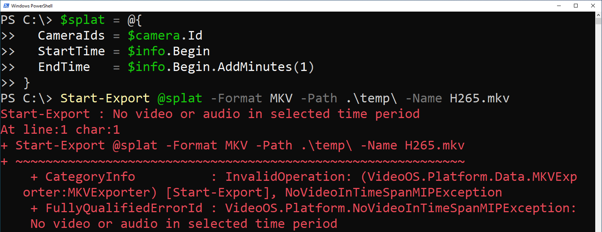
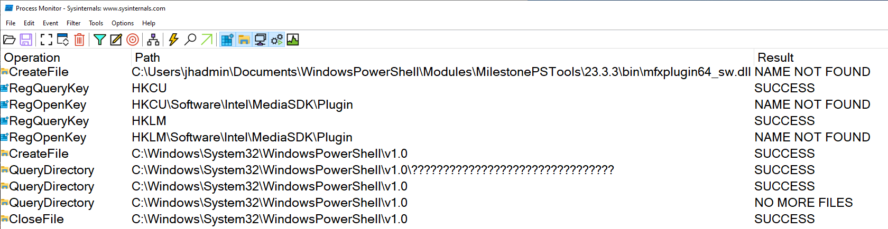
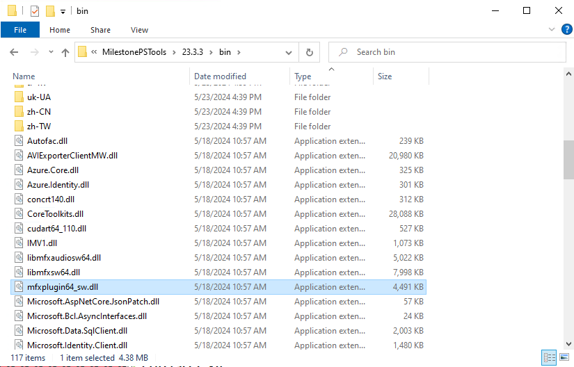

# Do you see errors when exporting H.265 video?



If so, you're not alone. In the process of researching the circumstances behind [Issue #126](https://github.com/MilestoneSystemsInc/PowerShellSamples/issues/126),
I discovered that MilestonePSTools has possibly _never_ been able to successfully export video, or retrieve snapshots
when the video codec is H.265. How did we miss this?

<!-- more -->

## Hardware vs software decoding

The phrase "it works on my machine" is the last thing you want to hear from a developer, but the handful of times this
issue was reported, I wasn't able to reproduce it. Actually, there was one short period of time at the end of 2023 when
I _could_ reproduce it, when a developer familiar with our core video processing libraries test it out, it worked fine.
And for reasons I didn't understand, I wasn't able to reproduce it anymore either.

I know now that the most likely reason I was able to reproduce the export error was because I had opened a PowerShell
terminal inside a virtual machine. And when exports were succeeding, I must have been running PowerShell on my laptop.
In most cases, a PowerShell session should behave the same whether you run it on a virtual machine or "bare metal".
However, when working with video, our SDK automatically takes advantage of compatible Intel and Nvidia GPUs and lets the
hardware do the heavy lifting.

When no compatible video card is available, we normally fall back to software decoding. That's what Smart Client does,
and even the [ExportSample](https://github.com/milestonesys/mipsdk-samples-component/tree/main/ExportSample) on GitHub
worked on the same machine where MilestonePSTools did not. I was stumped. Fortunately, I discovered I was able to reproduce the issue reliably from
my Proxmox virtual machines this week so I started to dig deeper for a root cause and solution.



Using the Sysinternals tool [Process Monitor](https://learn.microsoft.com/en-us/sysinternals/downloads/procmon), I noticed
the Intel MediaSDK library looking around the registry and filesystem for a software decoding plugin, and it was looking
for the plugin in an unexpected place.

## Root cause

When a standalone application like ExportSample uses our SDK, the executable file `ExportSample.exe` is in the same
folder as the MIP SDK DLL files. Included in the MIP SDK files is a folder containing the HEVC (H.265) software decoding
library for the Intel MediaSDK. The MediaSDK expects to find this library by looking in the directory of the running
application.

The reason the ExportSample could export H.265 video on a system without hardware accelerated decoding while
MilestonePSTools could not, is because MilestonePSTools runs _within_ Windows PowerShell and not as a standalone
executable. The executable for Windows PowerShell is found at `C:\windows\system32\WindowsPowerShell\v1.0\`, so Intel
MediaSDK was attempting to load the HEVC decoding library from `C:\windows\system32\WindowsPowerShell\v1.0\15dd936825ad475ea34e35f3f54217a6\mfxplugin64_hevcd_sw.dll`
instead of from the "bin" folder included with the MilestonePSTools module files.

## Solution

I copied the `15dd936825ad475ea34e35f3f54217a6` to `C:\windows\system32\WindowsPowerShell\v1.0\` and confirmed that it
_did_ solve the problem, but I would never suggest modifying the contents of your C:\Windows directory in a production
environment just to make a PowerShell module work. Looking a bit closer at the Process Monitor logs, I noticed the Intel
library probing for the presence of a file named `mfxplugin64_sw.dll` in the same "bin" directory as the rest of the MIP
SDK files. When I copied `bin\15dd936825ad475ea34e35f3f54217a6\mfxplugin64_hevcd_sw.dll` to `bin\mfxplugin64_sw.dll`, it
also appeared to solve the export problem.

The next MilestonePSTools release, v23.3.4, will ensure a copy of the HEVC decoding library is found in the bin folder
with the shorter filename. Until then, you can locate your `MilestonePSTools\<version>\bin` folder and make a copy of
this file yourself. When finished, the "bin" folder in your MilestonePSTools module should look like the following
screenshot.



### Method 1: PowerShell Script

If you installed MilestonePSTools with __AllUsers__ scope, you'll need to run the following in an elevated PowerShell
terminal (run as Administrator).

```powershell
Import-Module MilestonePSTools
$modulePath = ([io.fileinfo](Get-Module MilestonePSTools).Path).DirectoryName
$splat = @{
    Path        = Join-Path $modulePath 'bin\15dd936825ad475ea34e35f3f54217a6\mfxplugin64_hevcd_sw.dll'
    Destination = Join-Path $modulePath bin\mfxplugin64_sw.dll
}
Copy-Item @splat
```

### Method 2: Manual

1. Locate your MilestonePSTools module installation path. It is normally under `C:\Program Files\WindowsPowerShell\Modules\MilestonePSTools`
   or `C:\Users\<username>\Documents\WindowsPowerShell\Modules\MilestonePSTools`. You can also try running the first two
   lines of the script in Method 1, then looking at the module location by typing `$modulePath` to show the value.
2. Open the "bin" folder, and then the `15dd936825ad475ea34e35f3f54217a6` subfolder.
3. Copy `mfxplugin64_hevcd_sw.dll`
4. Go back up to the parent "bin" folder and paste the copied file.
5. Rename the copy of `mfxplugin64_hevcd_sw.dll` in the bin folder to `mfxplugin64_sw.dll`.

