# Updates to Import-VmsHardware

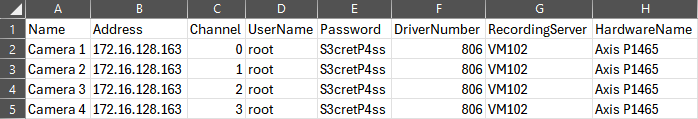

In the v24.1.9 relase of MilestonePSTools, the `Import-VmsHardware` and `Export-VmsHardware` cmdlets have been rewritten
to use a much simpler CSV format, add support for updating existing hardware instead of only adding new hardware, and we
now support _extremely detailed_ exports and imports using Excel. Thanks to the ImportExcel module by Doug Finke, you
don't even need Excel installed on the system running MilestonePSTools.

<!-- more -->

## New in v24.1.9

- CSV file now describes one device per row, including multiple camera or other device channel types on the same physical
  hardware.
- Any number of device credentials can now be provided using the `-Credential` parameter, instead of requiring the
  credential to be provided in plain text in the CSV file.
- Updated names, coordinates, storage configuration names, and enable-states can be applied to existing hardware during
  an import.
- The `Import-VmsHardware` command now produces more informative error messages in most situations, and returns a list
  of rows from the incoming CSV file with a `Result` property indicating success or failure to import, making it easier
  to know which devices may be remain to be configured after a large import.
- The `VmsImportHardwareExcel.psm1` script previously only provided in this documentation as a working example is now
  integrated into the `Import-VmsHardware` and `Export-VmsHardware` cmdlets. Simply use the `.xlsx` file extension when
  performing an export, and a detailed Excel workbook will be produced with several worksheets representing the detailed
  configuration of the selected hardware.

## CSV format

In previous versions of the module, the CSV file produced by `Export-VmsHardware` and expected by `Import-VmsHardware`
represented each _hardware_ record (the IP-based device with one or more cameras, micrphones, speakers, inputs, outputs,
metadata devcices) in a single row. In order to import a camera with multiple channels, or to enable the microphone or
metadata during import, you would provide a semicolon-delimited list of channel numbers to enable, and names to use for
those channels within a single row.

In the latest release, the CSV format has been updated so that each row in the file represents a single device channel.
That channel might be a camera, microphone, or any of the six types of devices you can find as child objects under a
hardware device on a recording server.

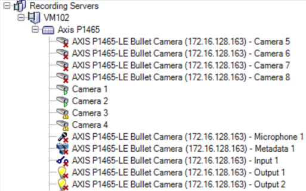

Since one or more rows can represent a single _hardware_ record in Milestone, during the import process we group all
records in the CSV based on the target recording server and the device's address value. That way, when you're creating
or updating your CSV file, the format is much easier to comprehend.

The only _required_ header in your CSV file is `Address` which can be an IP address, hostname, fully-qualified domain
name, or a full http(s) URL. However, most of the time you will probably want to include additional information like the
device name, hardware name, and credentials (unless you provide credentials using the `-Credential` parameter instead).

### Simplified format

To import the camera in the above screenshot, the CSV file can be as simple as:

| Name     | Address        | Channel | UserName | Password | RecordingServer | HardwareName |
|----------|----------------|---------|----------|----------|-----------------|--------------|
| Camera 1 | 172.16.128.163 | 0       | root     | S3cret   | VM102           | Axis P1465   |
| Camera 2 | 172.16.128.163 | 1       | root     | S3cret   | VM102           | Axis P1465   |
| Camera 3 | 172.16.128.163 | 2       | root     | S3cret   | VM102           | Axis P1465   |
| Camera 4 | 172.16.128.163 | 3       | root     | S3cret   | VM102           | Axis P1465   |

### Detailed format

A more detailed import which also sets the coordinates and storage configuration name, enables the metadata device, and
avoids the additional time to discover the correct device driver to use could look like this:

| DeviceType | Name     | Address        | Channel | UserName | Password | DriverNumber | RecordingServer | HardwareName | StorageName | Coordinates      | DeviceGroups                 |
|------------|----------|----------------|---------|----------|----------|--------------|-----------------|--------------|-------------|------------------|------------------------------|
| Camera     | Camera 1 | 172.16.128.163 | 0       | root     | S3cret   | 806          | VM102           | Axis P1465   | Short-term  | 45.417, -122.732 | /Models/Axis/P1465;/Imported |
| Camera     | Camera 2 | 172.16.128.163 | 1       | root     | S3cret   | 806          | VM102           | Axis P1465   | Short-term  | 45.417, -122.732 | /Models/Axis/P1465;/Imported |
| Camera     | Camera 3 | 172.16.128.163 | 2       | root     | S3cret   | 806          | VM102           | Axis P1465   | Short-term  | 45.417, -122.732 | /Models/Axis/P1465;/Imported |
| Camera     | Camera 4 | 172.16.128.163 | 3       | root     | S3cret   | 806          | VM102           | Axis P1465   | Short-term  | 45.417, -122.732 | /Models/Axis/P1465;/Imported |
| Metadata   | Metadata | 172.16.128.163 | 0       | root     | S3cret   | 806          | VM102           | Axis P1465   | Short-term  | 45.417, -122.732 | /Models/Axis/P1465;/Imported |

Importing the above data would...

- Add `172.16.128.163` to the recording server named `VM102` using the Axis driver with driver number 806.
- Enable the hardware and rename it to `Axis P1465`.
- Enable the first 4 camera channels, rename them, set their coordinates, move them from the default storage to the storage
  named `Short-term` (if it exists), and add them to two camera groups.
- Enable the first metadata channel, rename it, update the coordinates, assign it to the same `Short-term` storage, and
  add it to two metadata groups.

### Ew, those passwords are in plain text

You might have noticed those usernames and passwords just hanging out there in plain text. Don't worry, you don't have
to put them in the CSV file. You can leave the `UserName` and `Password` fields empty or remove the headers completely.
Instead, you can use the `Get-Credential` cmdlet at the command-line to generate a credential prompt. That way they are
never exposed in plain text.

```powershell
# If every device uses the same credentials, you can provide a single credential
Import-VmsHardware hardware.csv -Credential (Get-Credential)

# If more than one credential is used, you can provide multiple credentials
$credentials = 1..3 | ForEach-Object { Get-Credential -Message "Credential $_" }
Import-VmsHardware hardware.csv -Credential $credentials
```

## Excel format

It's not possible to design a CSV file that is both easy to fill out when the customer sends you a spreadsheet of device
names and addresses, and detailed enough to let you define which edge analytic events should be enabled, whether to
perform motion detection on keyframes only or all frames, and which resolution, codec, and FPS to use for which streams.

Fortunately, an Excel workbook with multiple worksheets can contain all of this information and more in an easy to read
format. That's what you get when you export to a `.xlsx` file.

However, because there is so much detail in an Excel export, it's impractical to create one by hand. So the recommended
workflow is to add cameras using a CSV file (or by hand), then export to an Excel file. From there, you can manipulate
the settings you want to change, and when you're ready, use `Import-VmsHardware hardware.xlsx -UpdateExisting` to bring
in the updates settings.

Similar to the CSV format, when importing an Excel file you do not have to include _all_ the worksheets and columns you
see in an export. If you only care to update basic camera information, you can include just the `Hardware` and `Camera`
sheets for the import.

### Embedded version of ImportExcel

To ensure ease of use of the MilestonePSTools module for those requiring the use of Excel files as well as those who
won't be using those features, a version of the ImportExcel module is included when you install MilestonePSTools version
24.1.9 or later. When using `Import-VmsHardware` or `Export-VmsHardware` with a file using a `.xlsx` extension, we check
to see if ImportExcel is already loaded in the current PowerShell session, or if a version is available on your machine.
If so, we'll use whatever version of ImportExcel is available. Otherwise, we will automatically use the version included
with MilestonePSTools. You don't need to download or install anything besides MilestonePSTools, but if you already use
ImportExcel for other things, we'll use it by default.

### Sample worksheet

=== "Hardware"
    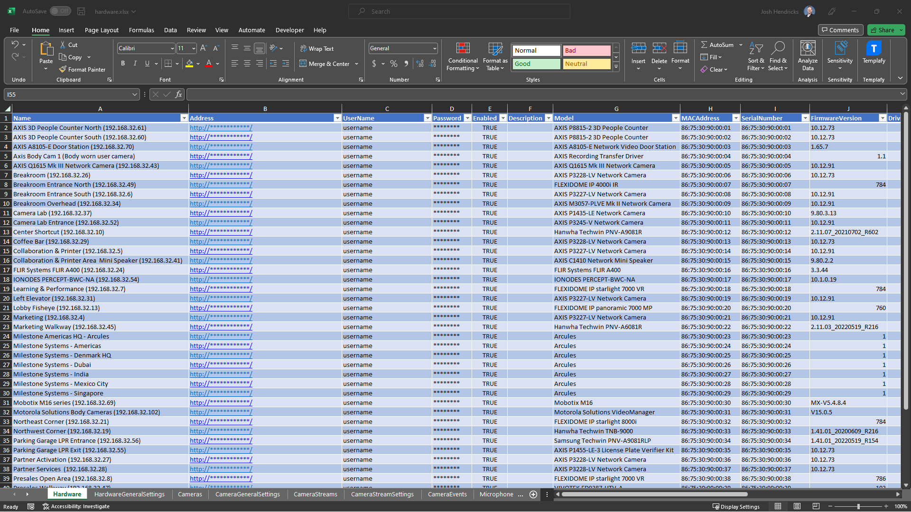{data-gallery="hardware-workbook"}

=== "HardwareGeneralSettings"
    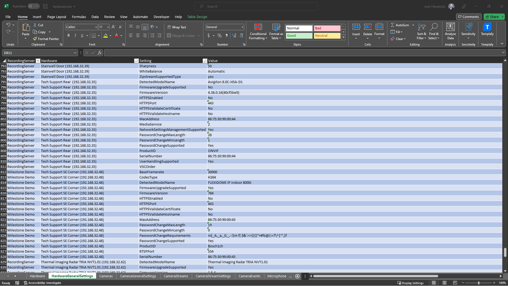{data-gallery="hardware-workbook"}

=== "Cameras"
    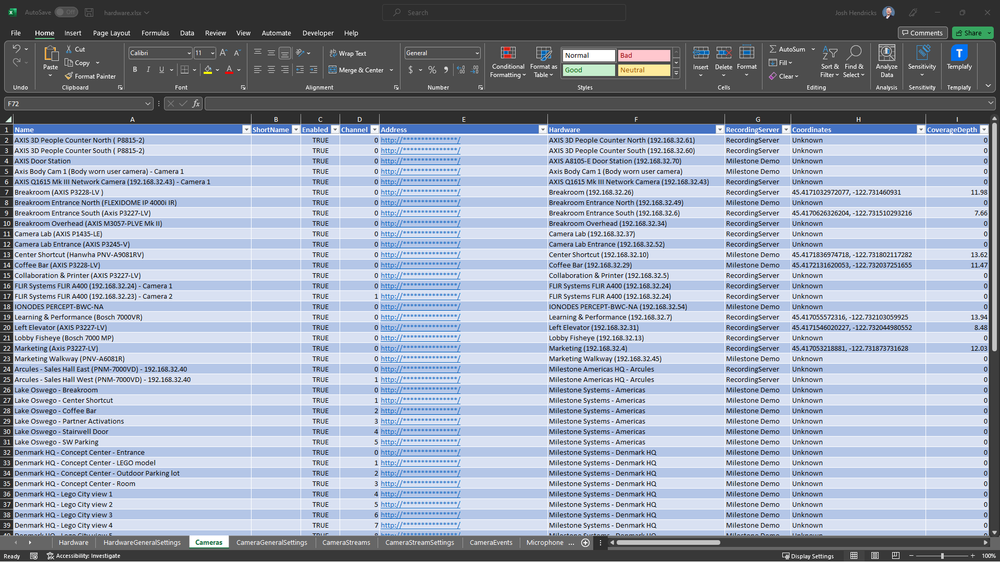{data-gallery="hardware-workbook"}

=== "CameraGeneralSettings"
    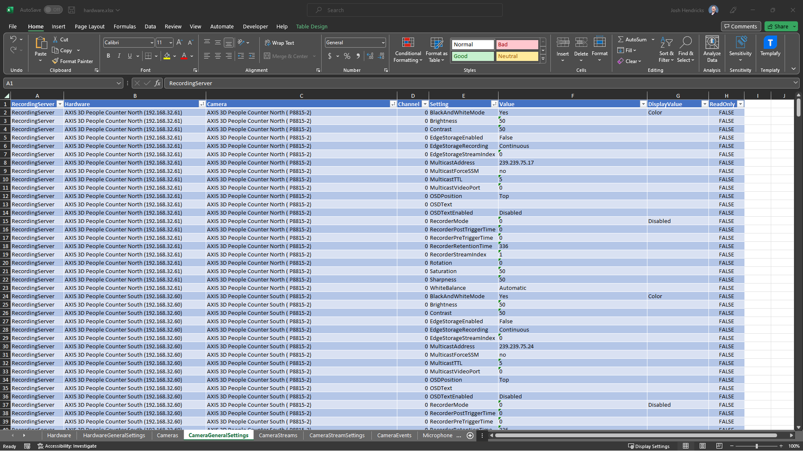{data-gallery="hardware-workbook"}

=== "CameraStreams"
    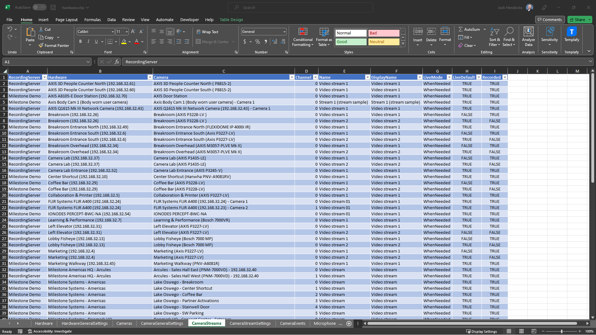{data-gallery="hardware-workbook"}

=== "CameraStreamSettings"
    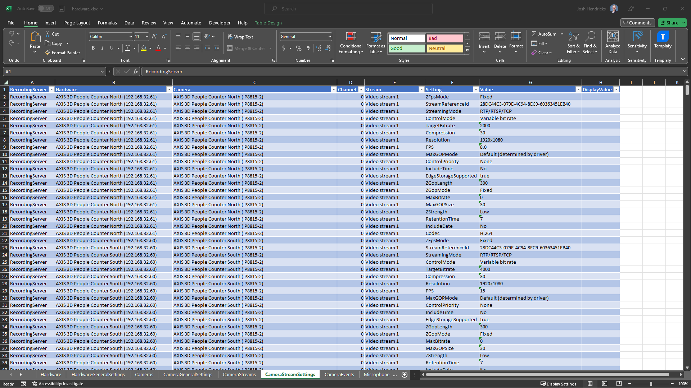{data-gallery="hardware-workbook"}

=== "CameraEvents"
    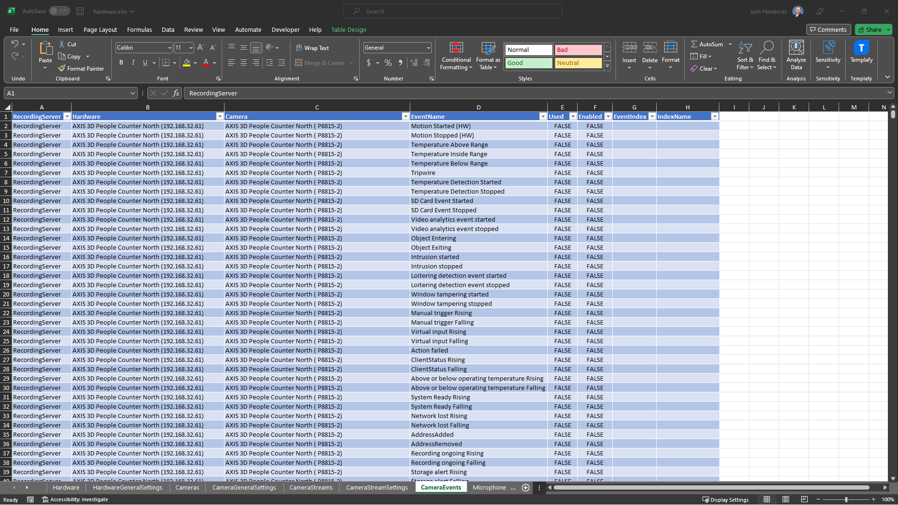{data-gallery="hardware-workbook"}

=== "Microphones"
    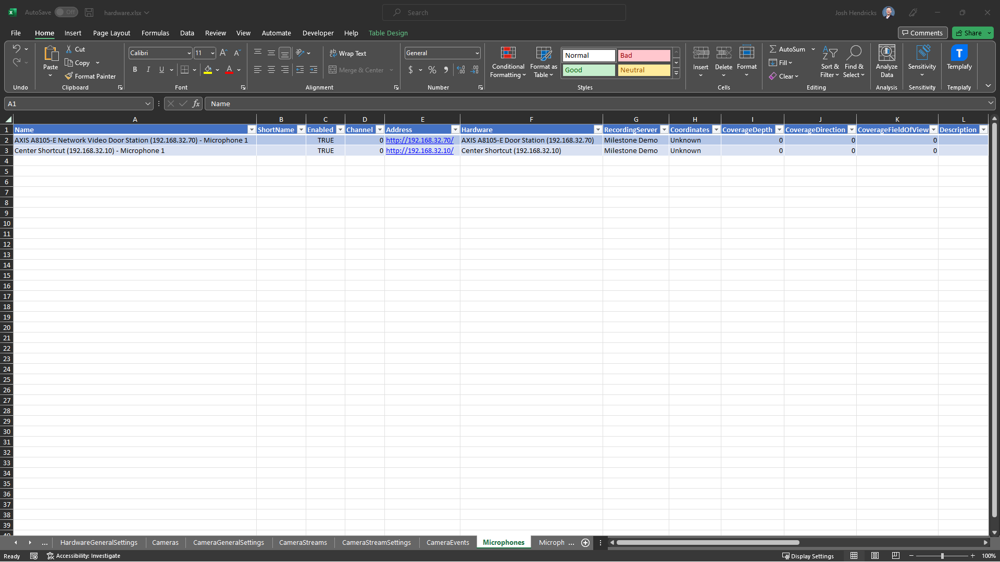{data-gallery="hardware-workbook"}

=== "MicrophoneGeneralSettings"
    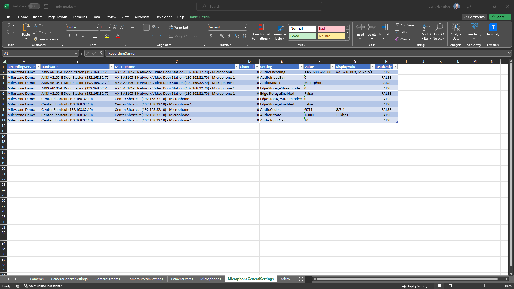{data-gallery="hardware-workbook"}

=== "MicrophoneEvents"
    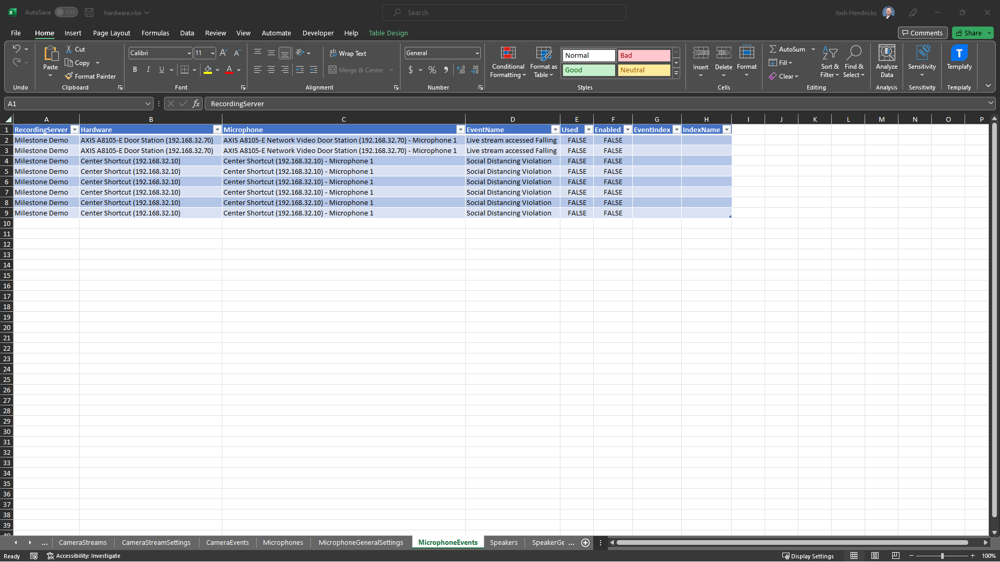{data-gallery="hardware-workbook"}
=== "Speakers"
    {data-gallery="hardware-workbook"}

=== "SpeakerGeneralSettings"
    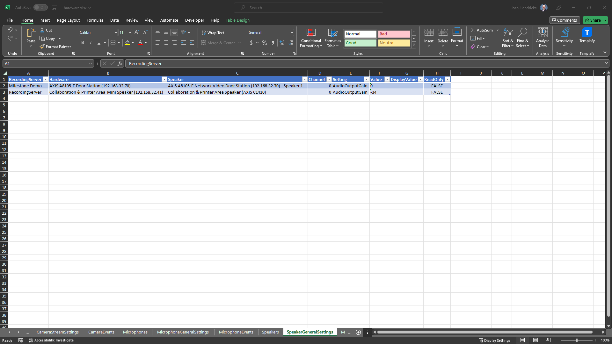{data-gallery="hardware-workbook"}

=== "Metadata"
    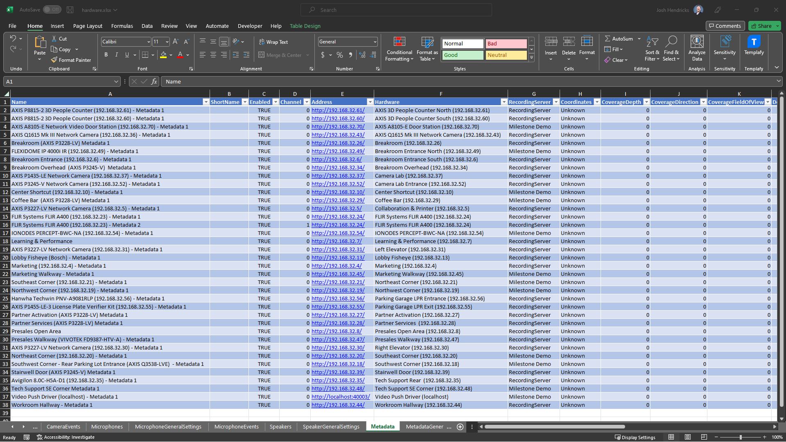{data-gallery="hardware-workbook"}

=== "MetadataGeneralSettings"
    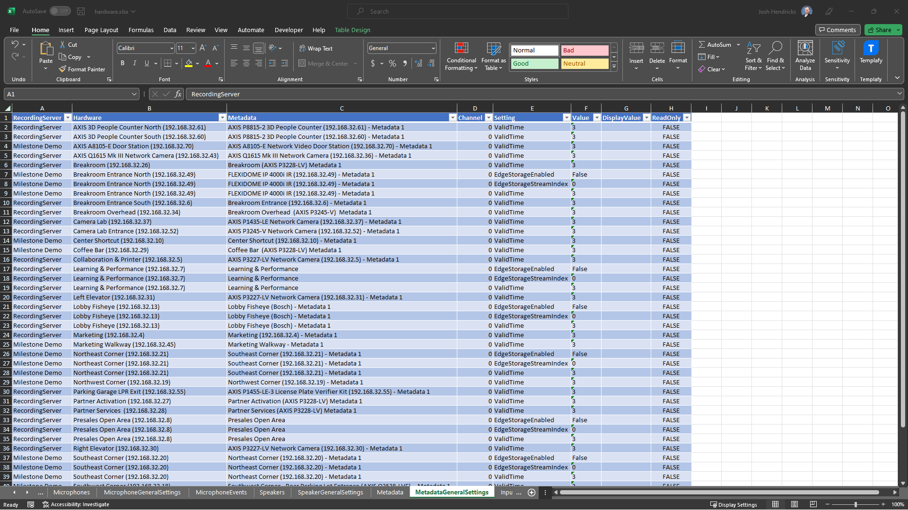{data-gallery="hardware-workbook"}

=== "Inputs"
    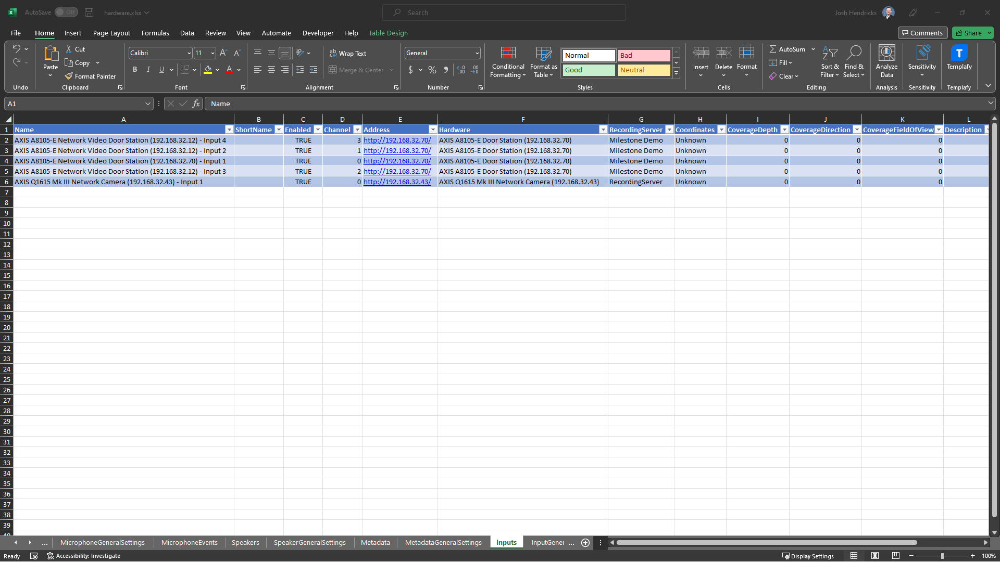{data-gallery="hardware-workbook"}

=== "InputGeneralSettings"
    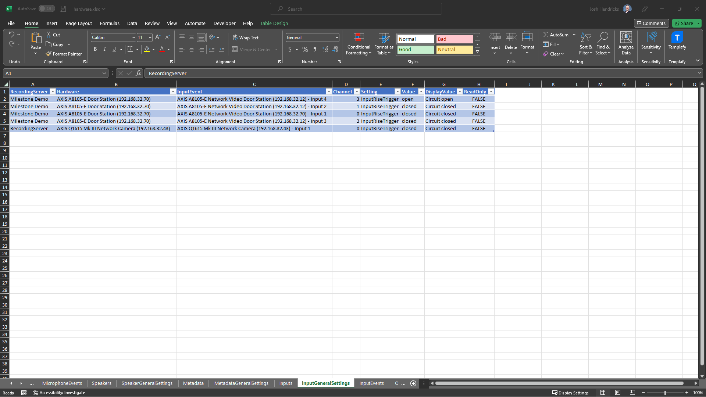{data-gallery="hardware-workbook"}

=== "InputEvents"
    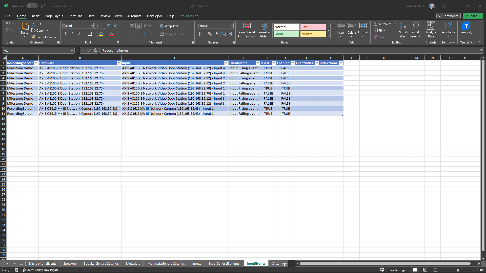{data-gallery="hardware-workbook"}

=== "Outputs"
    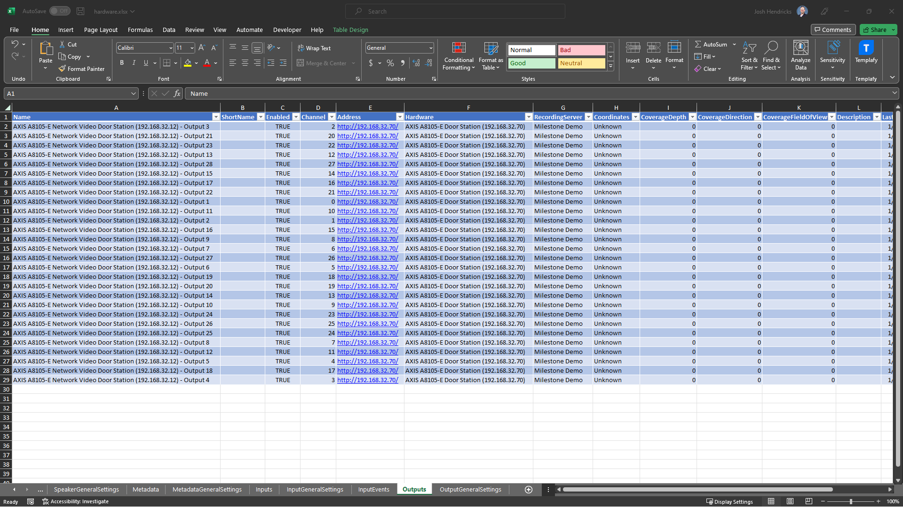{data-gallery="hardware-workbook"}

