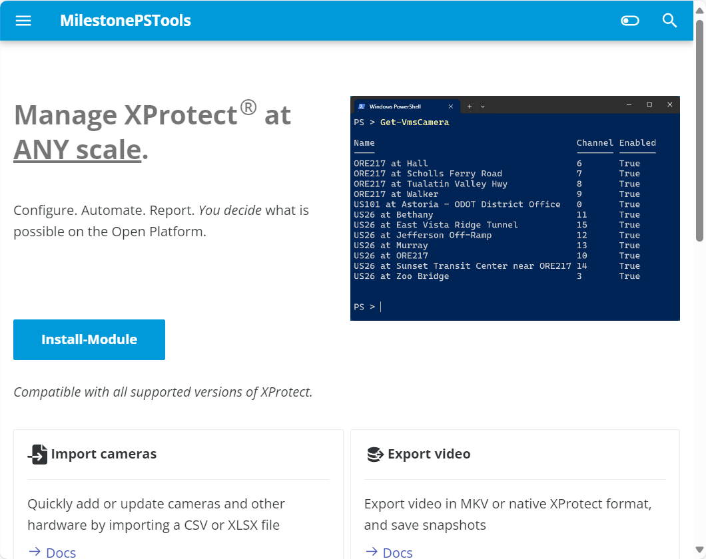
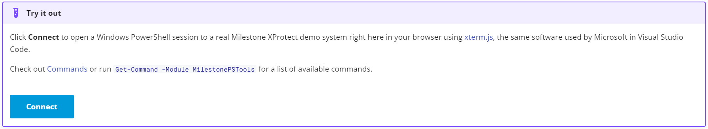
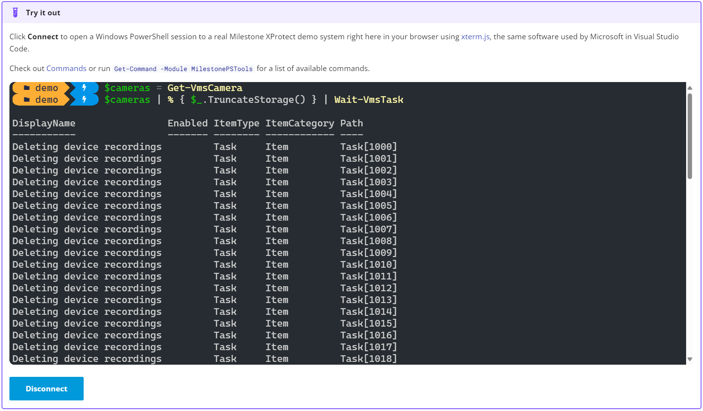

# Docs Updates

We've received some great feedback on the latest module release with the updates to the `Import-VmsHardware` and
`Export-VmsHardware` commands. In our current development cycle (sprint), one of our goals was to improve the
MilestonePSTools landing page and initial "onboarding" experience.

<!-- more -->

The previous home page was a bit word-heavy and did a poor job of delivering the "elevator pitch" that a good landing
or product page should offer. The new home page briefly describes the value, offers some talking points, has a "call to action"
(install the module), and introduces a new experimental feature - a live PowerShell terminal providing you with access
to a real XProtect Corporate test machine right there in the browser.

## Try it out

!!! note "2025-05-08 Update"
    The **Try it out** feature has been removed. It was a fun experiment with limited utility. The complexity of
    hosting and maintaining a backend virtual machine with the latest XProtect VMS, MilestonePSTools module, and
    Cloudflare tunnel daemon exceeded the value of having the feature available on the home page.

When you scroll to the bottom of the [home page](../../../index.md) you'll find a "Try it out" section with a "Connect"
button. Clicking **Connect** creates an [Xterm.js](https://xtermjs.org/) instance with a secure websocket connection
through a [Cloudflare Tunnel](https://developers.cloudflare.com/cloudflare-one/connections/connect-networks/) to a
Windows PowerShell terminal on a virtual machine running XProtect Corporate 2024 R1. That sounds kind of complicated but
for you, it's a simple click and you can try the module out right there in your browser.

This environment is intended to be tinkered with so you can add or remove hardware, modify roles and permissions, and
experiment before installing the module on your own system and running commands against your own VMS. This is especially
helpful for those who are new to PowerShell or those without a test VMS to evaluate potentially destructive commands on.

I hope you enjoy, and please continue to send us your feedback and report issues on GitHub at
[milestonesys/MilestonePSTools](https://www.github.com/milestonesys/MilestonePSTools).

