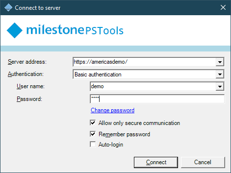

# Connect-ManagementServer

## SYNOPSIS

Connects to a Milestone XProtect VMS Management Server.

## SYNTAX

### NoLoginDialog
```
Connect-ManagementServer [[-ServerAddress] <Uri>] [[-Server] <String>] [-Port <Int32>]
 [[-Credential] <PSCredential>] [-BasicUser] [-SecureOnly] [-AcceptEula] [-IncludeChildSites] [-Force]
 [[-WcfProxyTimeoutSeconds] <Int32>] [<CommonParameters>]
```

### ShowLoginDialog
```
Connect-ManagementServer [-AcceptEula] [-IncludeChildSites] [-Force] [-ShowDialog] [-DisableAutoLogin]
 [[-WcfProxyTimeoutSeconds] <Int32>] [<CommonParameters>]
```

## DESCRIPTION

This command is used to authenticate with, and connect to one or more Milestone
XProtect VMS Management Servers. It is required to use
`Connect-ManagementServer` before using a great many cmdlets in the
MilestonePSTools module.

Supported authentication options match those of XProtect Management Client and
XProtect Smart Client including the current Windows user, a specified Windows
user, or a Milestone basic user.

When using MilestonePSTools interactively, you may opt to use a GUI-based login
dialog by including the `-ShowDialog` switch parameter.

When connecting to a parent management server in a Milestone Federated
Architecture hierarchy, you may use the `-IncludeChildSites` switch, and you
will automatically authenticate with each child site, recursively, in the
hierarchy.

REQUIREMENTS  

- Does not require a VMS connection

## EXAMPLES

### EXAMPLE 1

```powershell
Connect-ManagementServer -ShowDialog -ErrorAction Stop

Get-VmsHardware

Disconnect-ManagementServer
```

Prompts the user with a familiar Milestone login dialog to login to the
Management Server. With `-ErrorAction Stop`, a failure to authenticate will
prevent the next command from running.

Then `Get-VmsHardware` returns information for all hardware devices on all
recording servers in the current site.

Finally, `Disconnect-ManagementServer` logs out gracefully.

### EXAMPLE 2

```powershell
Connect-ManagementServer -ShowDialog -DisableAutoLogin
```

Prompts the user with a familiar Milestone login dialog to login to the Management Server and prevents automatic login in case that was used previously and isn't wanted now.

### EXAMPLE 3

```powershell
Connect-ManagementServer -Server mgtsrv1
```

This command authenticates with a server named mgtsrv1 where the server is listening on HTTP port 80, and it uses the current PowerShell user context.

If you have opened PowerShell normally, as your current Windows user, then the credentials used will be that of your current Windows user.

If you have opened PowerShell as a different user (shift-right-click, run as a different user), OR you are executing your script as a scheduled task, the user context will be that of whichever user account was used to start the PowerShell session.

### EXAMPLE 4

```powershell
Connect-ManagementServer -Server mgtsrv1 -Credential (Get-Credential)
```

This command will prompt the user for a username and password, then authenticates with a server named mgtsrv1 where the server is listening on HTTP port 80 using Windows authentication.

### EXAMPLE 5

```powershell
Connect-ManagementServer -Server mgtsrv1 -Credential (Get-Credential) -BasicUser
```

This command authenticates with a server named mgtsrv1 where the server is listening on HTTPS port 443, and it authenticates a basic user using the credentials supplied in the Get-Credential pop-up

Note: As a "Basic User", the user will not have access to child sites in a Milestone Federated Architecture and thus the -IncludeChildSites switch will not have any effect.

## PARAMETERS

### -AcceptEula

Deprecated. Used to indicate that you accept the terms of the end user license agreement supplied with the
MilestonePSTools module. It is no longer required indicate acceptance of the MIP SDK EULA.

```yaml
Type: SwitchParameter
Parameter Sets: (All)
Aliases:

Required: False
Position: 7
Default value: False
Accept pipeline input: False
Accept wildcard characters: False
```

### -BasicUser

Use Milestone's Basic User authentication instead of Windows or Active Directory.

```yaml
Type: SwitchParameter
Parameter Sets: NoLoginDialog
Aliases:

Required: False
Position: 5
Default value: False
Accept pipeline input: False
Accept wildcard characters: False
```

### -Credential

Specifies a user account that has permission to login to the Milestone XProtect
VMS Management Server. This can be a Windows, Active Directory, or Milestone
basic user.

- When omitted, authentication will proceed with the current Windows user.
- When specifying credentials for a basic user, you must also provide the
  `-BasicUser` parameter.

```yaml
Type: PSCredential
Parameter Sets: NoLoginDialog
Aliases:

Required: False
Position: 2
Default value: None
Accept pipeline input: False
Accept wildcard characters: False
```

### -DisableAutoLogin

Disables and prevents auto-login when showing the login dialog.

```yaml
Type: SwitchParameter
Parameter Sets: ShowLoginDialog
Aliases:

Required: False
Position: Named
Default value: False
Accept pipeline input: False
Accept wildcard characters: False
```

### -Force

Forces a `Disconnect-ManagementServer` prior to connecting to the specified
Management Server or displaying the login dialog.

```yaml
Type: SwitchParameter
Parameter Sets: (All)
Aliases:

Required: False
Position: 9
Default value: False
Accept pipeline input: False
Accept wildcard characters: False
```

### -IncludeChildSites

After successful authentication with the specified Management Server,
authentication should be performed on all child sites in a Milestone Federated
Architecture hierarchy.

```yaml
Type: SwitchParameter
Parameter Sets: (All)
Aliases:

Required: False
Position: 8
Default value: False
Accept pipeline input: False
Accept wildcard characters: False
```

### -Port

**Deprecated - please use ServerAddress.** Specifies, as an integer between
1-65535, the HTTP port of the Management Server. Default is 80.

*Note: When using basic authentication and a custom HTTP port on the Management
Server, leave this value alone. MIP SDK will automatically use HTTPS on port
443.*

```yaml
Type: Int32
Parameter Sets: NoLoginDialog
Aliases:

Required: False
Position: Named
Default value: 80
Accept pipeline input: False
Accept wildcard characters: False
```

### -SecureOnly

Specifies that an HTTPS connection is required for successful authentication.

*Note: Requires XProtect VMS versions 2021 R1 and newer.*

```yaml
Type: SwitchParameter
Parameter Sets: NoLoginDialog
Aliases:

Required: False
Position: 6
Default value: False
Accept pipeline input: False
Accept wildcard characters: False
```

### -Server

**Deprecated - please use ServerAddress.** Specifies the address of the
Milestone XProtect VMS Management Server as an IP, hostname, or FQDN.

```yaml
Type: String
Parameter Sets: NoLoginDialog
Aliases:

Required: False
Position: 1
Default value: Localhost
Accept pipeline input: False
Accept wildcard characters: False
```

### -ServerAddress

Specifies the HTTP or HTTPS server address of the Milestone XProtect VMS
Management Server.

```yaml
Type: Uri
Parameter Sets: NoLoginDialog
Aliases:

Required: False
Position: 99
Default value: http://localhost/
Accept pipeline input: False
Accept wildcard characters: False
```

### -ShowDialog

Show a familiar Milestone login dialog. The dialog supports "Remember password"
, and "Auto login".



REQUIREMENTS  

- Requires an interactive PowerShell session.

```yaml
Type: SwitchParameter
Parameter Sets: ShowLoginDialog
Aliases:

Required: True
Position: Named
Default value: False
Accept pipeline input: False
Accept wildcard characters: False
```

### -WcfProxyTimeoutSeconds

Specifies, as an integer value, the maximum number of idle seconds before a Windows Communication Foundation (WCF) channel, used to communicate with Milestone XProtect API's, is considered timed out.

The Configuration API, used directly by commands like `Get-ConfigurationItem`
and `Invoke-Method`, and sometimes indirectly by other commands in the
module, uses WCF. There are other API's you can access, such as through the
WCF proxy returned by `Get-IServerCommandService`, which also are configured to
use the timeout specified here.

The default setting is suitable for most common usage patterns for this module.

```yaml
Type: Int32
Parameter Sets: (All)
Aliases:

Required: False
Position: 10
Default value: 300
Accept pipeline input: False
Accept wildcard characters: False
```

### CommonParameters
This cmdlet supports the common parameters: -Debug, -ErrorAction, -ErrorVariable, -InformationAction, -InformationVariable, -OutVariable, -OutBuffer, -PipelineVariable, -Verbose, -WarningAction, and -WarningVariable. For more information, see [about_CommonParameters](http://go.microsoft.com/fwlink/?LinkID=113216).

## INPUTS

### None

`Connect-ManagementServer` does not accept pipeline input.

## OUTPUTS

### None

Unless an error occurs, `Connect-ManagementServer` does not generate output.

## NOTES

When using `-ShowDialog`, the MIP SDK stores the login history in `C:\Users\jh\AppData\Roaming\MIPSDK\LoginHistory.xml`.

## RELATED LINKS
