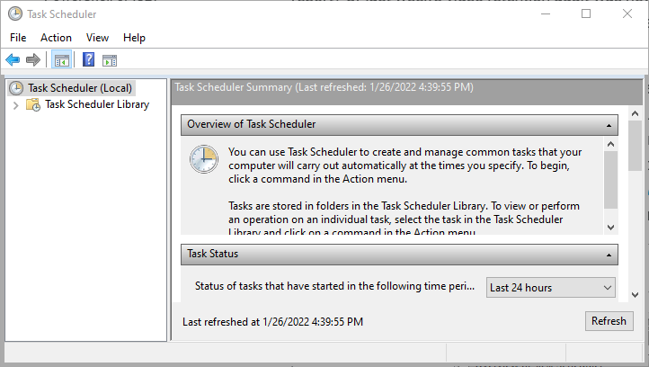

# Automation with Task Scheduler

## Introduction

Using MilestonePSTools, and PowerShell in general, can save an enormous amount
of time and greatly improve consistency in the tasks you automate. But what if
you *forget* to run today's report? Or last week's video retention audit was
never sent because you were on vacation, and two weeks later you discover you're
not meeting the expected retention thanks to an unapproved configuration change
made during your absence?

Any scripts that you want to run on a regular basis should be **scheduled** to
run, so that they get the job done even in your absence, and to free you up to
think about other important tasks. There are multiple ways to schedule a script
to run in Windows, including
[Task Scheduler](https://docs.microsoft.com/en-us/windows/win32/taskschd/about-the-task-scheduler){target="_blank"},
[Scheduled Jobs](https://docs.microsoft.com/en-us/powershell/module/psscheduledjob/about/about_scheduled_jobs?view=powershell-5.1){target="_blank"},
and 3rd party task-runners including PowerShell-focused task automation tools like
[PowerShell Universal](https://ironmansoftware.com/powershell-universal/){target="_blank"},
and [ScriptRunner](https://www.scriptrunner.com/){target="_blank"}, which both
have a great reputation in the PowerShell community.



In this guide we're going to keep it simple and use the Task Scheduler to
run a camera report script every day at midnight. The script needs to
authenticate with the Management Server and there are two scenarios covered in
this guide...

1. The script will run as a Windows user which **is** authorized to login to the VMS.
2. The script will **not** run as an authorized VMS user and you will have to
   pass credentials to your script securely.

!!! info "Recommendation"

    We recommend that you use a **dedicated Windows or basic user account** for use
    with unattended scripts, and to avoid adding these accounts to the built-in
    Administrators role in Milestone.

    Instead, create a special role with **limited permissions**. If your
    scripts will *never* make configuration changes, don't grant them write
    permissions. This may well save you in the future in the event the account
    credentials are leaked, or you accidentally run a destructive command.

    We also recommend that the Windows service account used to run a script is
    dedicated to the task and not reused for other purposes. It should have
    minimal access to the local computer and domain resources. Follow the
    [principal of least privilege](https://www.cisa.gov/uscert/bsi/articles/knowledge/principles/least-privilege){target="_blank"}.

## Preparation

Before you start, please make sure of the following...

- All commands are entered in Windows PowerShell x64. The 64-bit powershell.exe
  should be the default, but if you have PowerShell 6+ installed,
  MilestonePSTools *will not work there*. You must run your commands in
  Windows Powershell.
- MilestonePSTools is installed, preferably for all users, but CurrentUser scope
  is okay as long as the service account used to run the scheduled task has
  access to the module.
- You have access to run PowerShell with elevation when needed. Not all commands
  require elevation, but you must run PowerShell as administrator when
  registering scheduled tasks or installing modules with "AllUsers" scope.

The process of creating a scheduled task to run a script which uses
MilestonePSTools doesn't vary much based on the type of authentication you plan
to use. We'll start with the easy option - Windows authentication (current user).

### Windows authentication (current user)

Milestone's MIP SDK supports "single sign-on" for local Windows and Active
Directory users, and so does the `Connect-Vms` cmdlet. By omitting
the optional `-Credential` parameter, the cmdlet will attempt to login as the
current user based on the security context for the PowerShell session.

This scenario is the easiest to handle since we don't have to consider storage
and retrieval of Windows or basic user credentials. As a result, the script is
a bit shorter. Save this as a **.PS1** file at the specified path, or a path of
your choosing. If you use a different path, make sure to enter your chosen path
when setting up the scheduled task.

```powershell linenums="1" title="C:\scripts\camera-report.ps1"
$connectionParams = @{ # (1)!
    ServerAddress = 'http://mgmt/' # (2)!
    AcceptEula    = $true # (3)!
    ErrorAction   = 'Stop' #(4)!
}
Connect-Vms @connectionParams
try { #(5)!
    $timestamp = Get-Date -Format 'yyyy-MM-dd_HH-mm-ss'
    $path = '{0}\Camera-Report_{1}.csv' -f $PSScriptRoot, $timestamp
    Get-VmsCameraReport -IncludeRetentionInfo -Verbose | Export-Csv -Path $path
} finally {
    Disconnect-ManagementServer
}
```

1. This hashtable will be [Splatted](https://docs.microsoft.com/en-us/powershell/module/microsoft.powershell.core/about/about_splatting?view=powershell-5.1){target="_blank"} into `Connect-Vms`. This is
   done here to minimize the line width.
2. The `-ServerAddress` value here will need to be replaced with your own
   Management Server address.
3. The `-AcceptEula` switch parameter is only required the first time your user
   logs in. After that, a flag is stored in your AppData path. I like to add it
   to scripts just in case that flag is reset for any reason. Otherwise, the
   script could fail to run, and we don't want that!
4. The `-ErrorAction` parameter is set to "Stop" so that a failed login to the
   Management Server halts the script. Normally PowerShell will move to the
   next command unless you set the ErrorAction or `$ErrorActionPreference`
   variable.
5. While not strictly necessary, this try/finally block assures us that no
   matter what happens between lines 8-10 inside the **try** block, we will
   always logout from the Management Server gracefully, because the code in the
   **finally** block will always run unless something kills the PowerShell.exe
   process.

If you are able to use the "Windows authentication (current user)" option, you
can now skip to the [Task Scheduler](#task-scheduler) section.

### Windows and basic user authentication

There are a lot of reasons why you might not be able to use the "current user"
option. That leaves you with the task of finding a safe way to store credentials
for your script for the purpose of authentication.

In this section we'll introduce a couple of great PowerShell modules from
Microsoft and show you how to use them to keep your credentials safe.

#### Agenda

1. Install SecretManagement module
2. Register SecretStore vault
3. Create secret
4. Disable SecretStore password
5. Retrieve secret & authenticate

#### 1. Install SecretManagment module

Microsoft published [Microsoft.PowerShell.SecretManagement](https://www.powershellgallery.com/packages/Microsoft.PowerShell.SecretManagement/){target="_blank"} on the PowerShell Gallery and
it's an excellent secret management framework for PowerShell with built-in
support for extensions. The extensions enable you to use the familiar
SecretManagement cmdlets to manage secrets that are backed by an existing Azure
KeyVault, KeePass, or other secret management product.

!!! tip

    If you have several systems which need access to
    the same secrets, you might consider an alternative vault extension and use a
    central location for storing secrets. This way if an API key or credential
    changes, you only need to update it in one place.

In this example we'll keep things simple and use Microsoft's 1st party vault
extension, SecretStore. Run the following line in an elevated terminal to
install both SecretManagement, and SecretStore, for all users.

```powershell title="Run with elevation"
Install-Module Microsoft.PowerShell.SecretStore -Scope AllUsers
```

#### 2. Register SecretStore vault

Now that the SecretStore vault extension module is installed, along with the
SecretManagement module, the SecretStore extension needs to be "registered" for
use with SecretManagement.

Copy and paste the following into a PowerShell terminal to register
SecretStore, set the vault name to "SecretStore", and make it the default
vault.

```powershell
Register-SecretVault -ModuleName Microsoft.PowerShell.SecretStore -Name SecretStore -DefaultVault
```

#### 3. Create secret

With the SecretStore registered, we can store our first secret and practice
retrieving it.

Copy the following lines and modify the ServerAddress value to reflect your own
VMS server address. At this point you will be prompted to set an initial vault
password for the SecretStore vault.

```powershell
$connectionParams = @{
    ServerAddress = 'http://mgmt/'
    Credential = Get-Credential
}
Set-Secret -Name 'MilestonePSTools.Connection' -Secret $connectionParams # (1)!
Get-Secret -Name 'MilestonePSTools.Connection' -AsPlainText # (2)!

<# OUTPUT
  Creating a new SecretStore vault. A password is required by the current store configuration.
  Enter password:
  *********
  Enter password again for verification:
  *********

  Name                           Value
  ----                           -----
  ServerAddress                  http://mgmt/
  Credential                     System.Management.Automation.PSCredential
#>
```

1. The name can be anything. Set it to anything meaningful to you, and use the
   name to recall the secret later. I like this because it clearly defines that
   the secret is for use with MilestonePSTools for connection.
2. The address of the server is in plain text, but the credential object is
   still a `[PSCredential]` which is what we'll be passing to the
   `Connect-Vms` cmdlet later.

!!! important

    Pay close attention to the user account you are running commands with. The
    SecretStore vault is a **per-user** vault, so if you set the secret under
    your personal Windows user account and the script is running under a
    different user account, the script will not be able to find your secret.

#### 4. Disable SecretStore password

The script is going to run on a schedule without any opportunity for user
input. If the SecretStore vault is password protected, then we need to come up
with a strategy for safely storing a vault password to use to unlock the vault
and retrieve the Milestone credentials. Initially the plan for this guide was
to demonstrate how you could do this, but in the end, it's not a common
practice and we chose not to encourage the idea of using unfamiliar strategies
to encrypt and store secrets to unlock other secrets.

This means the vault is protected solely by the authentication of the service
account under which the secret will be stored. It's important for the service
account to have limited permissions, and for the Milestone credentials to have
limited permissions as well. By following the principal of least privilege, you
minimize the scope and impact of a security breach.

To disable password authentication for the SecretStore vault, run the following
command. Again, be sure to run the command under the same user that will be
used to run the scheduled task. The SecretStore vault is different for each
user.

```powershell
Set-SecretStoreConfiguration -Authentication None

<# OUTPUT
  Confirm
  Are you sure you want to perform this action?
  Performing the operation "Changes local store configuration" on target "SecretStore module local store".
  [Y] Yes  [A] Yes to All  [N] No  [L] No to All  [S] Suspend  [?] Help (default is "Y"): y
  A password is no longer required for the local store configuration.
  To complete the change please provide the current password.
  Enter password:
  *********
#>
```

#### 5. Retrieve secret & authenticate

We're nearly finished. Here is the same camera report script used for "current user"
authentication, with a minor modification to load our connection parameters
from the SecretStore vault, and add a couple extra parameters we couldn't put
in the stored secret...

```powershell linenums="1" title="C:\scripts\camera-report.ps1"
$connectionParams = Get-Secret -Name 'MilestonePSTools.Connection' -AsPlainText
$connectionParams.BasicUser = $false # (1)!
$connectionParams.AcceptEula = $true
$connectionParams.ErrorAction = 'Stop'
Connect-Vms @connectionParams
try {
    $timestamp = Get-Date -Format 'yyyy-MM-dd_HH-mm-ss'
    $path = '{0}\Camera-Report_{1}.csv' -f $PSScriptRoot, $timestamp
    Get-VmsCameraReport -IncludeRetentionInfo -Verbose | Export-Csv -Path $path
} finally {
    Disconnect-ManagementServer
}
```

1. Change this to `$true` if the Milestone credential is for a basic user.
   These boolean values unfortunately cannot be stored by SecretStore, so they
   are being added here before splatting the `$connectionParams` variable into
   the `Connect-Vms` cmdlet.

##### Test run

Now is a good time to test-run the script to make sure it works when you run it
manually. If you saved your script in the "C:\scripts\" folder, run it like so...

```powershell
C:\scripts\camera-report.ps1

<# OUTPUT
  VERBOSE: Environment variable "MILESTONEPSTOOLS_PROXYCOUNT" unset or not a valid integer. Defaulting to 1 WCF proxy client per client type.
  VERBOSE: Creating new WCF channel of type VideoOS.Common.Proxy.Server.WCF.IServerCommandService
  VERBOSE: Listing all recording servers
  VERBOSE: Calling Get-ItemState
  VERBOSE: Starting FillChildren threadjob
  VERBOSE: Starting Get-PlaybackInfo threadjob
  VERBOSE: Starting GetVideoDeviceStatistics threadjob
  VERBOSE: Starting GetCurrentDeviceStatus threadjob
  VERBOSE: Receiving results of FillChildren threadjob
  VERBOSE: Receiving results of Get-PlaybackInfo threadjob
  VERBOSE: Receiving results of GetVideoDeviceStatistics threadjobs
  VERBOSE: Receiving results of GetCurrentDeviceStatus threadjobs
#>
```

You should see similar output, and if so, you should also find a new CSV file
in the same folder as **camera-report.ps1**.

## Task Scheduler

Finally, we're ready to setup the script to run on a schedule. Since this is a
PowerShell guide, we're going to demonstrate how to create the scheduled task
with PowerShell instead of using the Task Scheduler user interface. You'll
find the PowerShell splatting feature used thoroughly here as some cmdlets
require several parameters and putting these all on one line makes scripts
difficult to read and understand.

```powershell linenums="1" title="Run with elevation"
$actionParams = @{
    Execute  = 'powershell.exe'
    Argument = '-NoLogo -NoProfile -File C:\scripts\camera-report.ps1'
}
$action = New-ScheduledTaskAction @actionParams

$settingsParams = @{
    StartWhenAvailable = $true
    ExecutionTimeLimit = New-TimeSpan -Hours 12
    MultipleInstances  = 'IgnoreNew'
}
$settings = New-ScheduledTaskSettingsSet @settingsParams

$credentialParams = @{
    UserName = [System.Security.Principal.WindowsIdentity]::GetCurrent().Name
    Message = 'Enter credentials for the scheduled task to use.'
}
$credential = (Get-Credential @credentialParams).GetNetworkCredential()

$registerParams = @{
    TaskName = 'Daily Camera Report'
    TaskPath = '\MilestonePSTools\'
    Trigger = New-ScheduledTaskTrigger -Daily -At (Get-Date).Date
    Action = $action
    Settings = $settings
    User = $credential.UserName
    Password = $credential.Password
}
Register-ScheduledTask @registerParams | Start-ScheduledTask
Get-ScheduledTask -TaskPath \MilestonePSTools\*

<# OUTPUT
TaskPath                                       TaskName                          State
--------                                       --------                          -----
\MilestonePSTools\                             Daily Camera Report               Running
#>
```

When you run this script, you will be asked to enter credentials for the
Task Scheduler to use when running the camera report script. Then the scheduled
task will be registered under a new folder or "path" in Task Scheduler, named
MilestonePSTools. If successful, the new scheduled task will then be started.

Normally within a few minutes you should see a new CSV file in the same folder
as the camera report script.

## Conclusion

Now that you have your first script setup to run on a schedule, it's a good
time to think about what other tasks, or reports, you can automate in the same
way. Users of MilestonePSTools are using PowerShell to help with a broad range
of tasks including...

- Regular camera status reporting
- Video retention auditing
- Shipping VMS logs to external log aggregation products like syslog servers or Splunk
- Role membership and permission auditing
- Monitoring of configuration drift
- Scheduled exports of evidence locked video or bookmarks
- Periodic live snapshots to check for changes in scene quality
- Exports of LPR reports
- Inspection of recording sequences to look for significant changes in the
  amount of recorded footage over a given period

There's no end to the kind of tasks that can be automated. We hope you found this
guide useful. If you would like to report an issue or leave a suggestion, please
feel free to post an issue at the GitHub repository linked at the top of this site.

