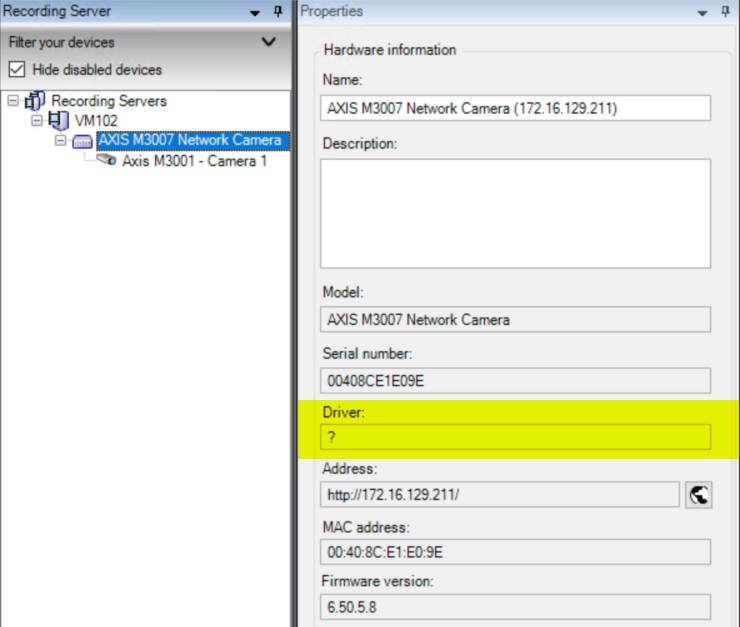

---
authors:
  - joshooaj
---

# Find & Replace Hardware with Unknown Driver

## Overview

Device Pack drivers are occasionally "retired" from the main device pack installation to the legacy device pack.
This is done to reduce the size of the device pack, and improve the recording server startup time after device pack
changes. However, if you have cameras using drivers that have been removed from the main device pack, you may be
left with many cameras offline after an upgrade.

This is what you will find in the hardware properties in the management client if the driver is no longer available
on the recording server:



To resolve this issue within the management client, you can right-click on the hardware, choose "Replace Hardware",
and step through the wizard where you will select the new driver to use. However, when there are hundreds or
thousands of devices that need to use a new driver, doing this by hand requires an unreasonable time commitment.
There is no option to perform this in bulk within the management client.

The `Set-VmsHardwareDriver` command from the MilestonePSTools module allows you to change the driver on one or more
devices. This example script helps by finding only the hardware records with an unrecognized driver, prompting you
to select one or more of those devices, then prompting for the driver to use on the selected devices before running
the `Set-VmsHardwareDriver` command to change the driver.

The process can still take a long time to process hundreds or thousands of cameras, but while it is running you can
step away from the keyboard and work on other tasks.

## Instructions

To run this example you can download and run the provided `ReplaceUnknownHardwareDrivers.ps1` script, or copy the
contents below and paste them into your PowerShell terminal. If there are no cameras with unknown drivers, then
no actions will be taken. Also, you will be prompted for confirmation by the `Set-VmsHardwareDriver` command before
any driver changes are made.

If you receive an error indicating that the hardware would have fewer device channels with the new driver than it
has on the current driver, you can add the parameter `-AllowDeletingDisabledDevices` to the `Set-VmsHardwareDriver`
command which will allow the server to delete disabled devices that will not be present after the driver change.

[Download :material-download:](../scripts/ReplaceUnknownHardwareDrivers.ps1){ .md-button .md-button--primary }

## :material-powershell: Code

```powershell linenums="1" title="ReplaceUnknownHardwareDrivers.ps1"
--8<-- "scripts/ReplaceUnknownHardwareDrivers.ps1"
```

--8<-- "abbreviations.md"
