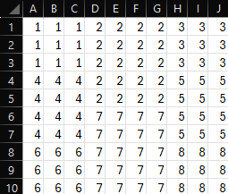
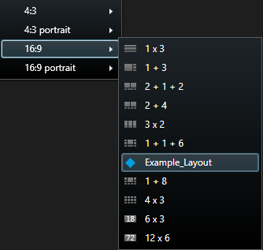
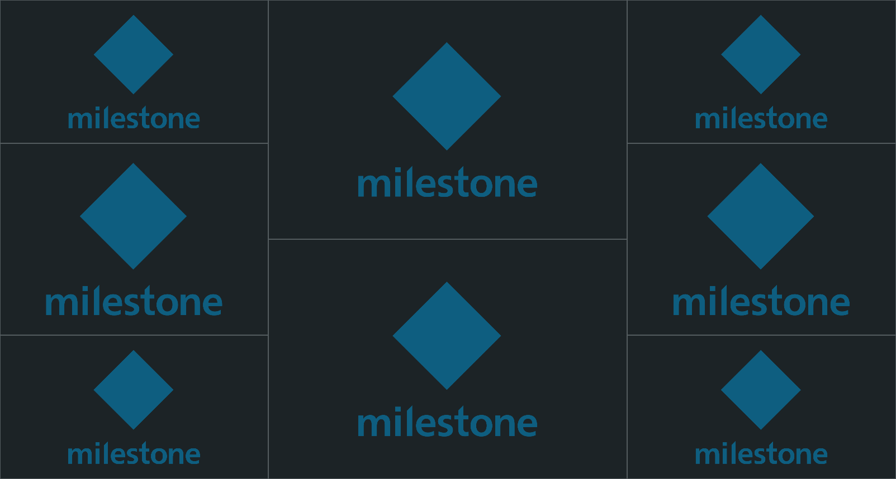

---
authors:
  - tarterman
---

# Create/Delete Custom View Layouts

## Overview

XProtect Smart Client comes with a number of view layouts built-in. However, sometimes there is a need (or desire) to
create a custom layout. The MIP SDK has supported this functionalality for quite a while, but one needed to be a
developer in order to create them.

MilestonePSTools has also been able to do this for a while, since it sits on top of the MIP SDK. However, it has not
been very intuitive because the view layout has to be provided in XML. An XML element is needed for each pane in the
view layout and the element specifies each panes starting coordinates (in a 1000x1000 grid), as well as the width and
height of the pane. Here is an example of the XML for one pane:

```xml
<ViewItems>
  <ViewItem>
    <Position>
      <X>0</X>
      <Y>0</Y>
    </Position>
    <Size>
      <Width>500</Width>
      <Height>500</Height>
    </Size>
  </ViewItem>
</ViewItems>
```

It is easy to see that this can become very cumbersome, very quickly. To assist with this, two sample scripts have been
created. One will create custom view layouts (`Add-VmsViewLayout`) and the other will remove custom view layouts
(`Remove-VmsViewLayout`).

## Instructions

To use `Add-VmsViewLayout`, the first step is to create a CSV file. It is strongly recommended to use an application
such as Excel, Google Sheets, LibreOffice Calc, or any other spreadsheet application that allows saving in CSV. Before
starting, it is also recommended to make the column widths roughly equal to the row heights. This isn't required, but
it helps with visualizing the layout. The number of rows and columns can be any number, but they should equal each
other. Also, note that the number of rows/columns has no bearing on how the view will look in the Smart Client. If you
can design the view layout you want with 10 rows/columns, then use that. If you need to use 20 rows/columns to get the
granularity you need, then use 20.

To create a layout, you need to put the same number in any cells that will be part of the same pane. The numbers in
panes need to form squares/rectangles. If they don't, the layout will end up having unused space. Once finished, save
the file as a CSV. Here is an example of a view layout that will have eight view panes.



The contents of the CSV file look like this:

```csv
1,1,1,2,2,2,2,3,3,3
1,1,1,2,2,2,2,3,3,3
1,1,1,2,2,2,2,3,3,3
4,4,4,2,2,2,2,5,5,5
4,4,4,2,2,2,2,5,5,5
4,4,4,7,7,7,7,5,5,5
4,4,4,7,7,7,7,5,5,5
6,6,6,7,7,7,7,8,8,8
6,6,6,7,7,7,7,8,8,8
6,6,6,7,7,7,7,8,8,8
```

In addition to specifying the view layout, a view icon can also be specified. The icon should have an equal number of
pixels for its length and width, because it will be reduced down to 16x16. If no image is specified for the icon, a
basic gray square will be used.

Here is a command that will create a view layout using the CSV file shown above, with a blue diamond for the icon. The
layout will be placed in the '16:9' view layout folder in the Smart Client.

```powershell
Add-VmsViewLayout -ViewLayoutName 'Example_Layout' -CsvPath 'C:\tmp\example_view_layout.csv' -LayoutFolder 16:9 -IconPath 'C:\tmp\blue_diamond.png'`
```

After that command is finished, there will be a new view layout available in the '16:9' layout folder.



Below is how the view looks like in the XProtect Smart Client.



There is also a function for removing custom view layouts. That is done by running `Remove-VmsViewLayout` and specifying
the `LayoutFolder` and the `ViewLayoutName`. To see a list of custom layouts that have been created, you can run:

```powershell
Remove-VmsViewLayout -ListCustomLayouts
```

In the system where only the layout example above has been added, the output looks like this:

```Output
View Layout Name View Layout Folder
---------------- ------------------
Example_Layout   16:9
```

To remove the above custom view layout, run the following command:

```powershell
Remove-VmsViewLayout -ViewLayoutName 'Example_Layout' -LayoutFolder 16:9
```

!!! note
    Even though the view layout is removed, any views that have been created using the layout will remain.

## :material-powershell: Add-VmsViewLayout

[Download :material-download:](../scripts/AddRemoveViewLayouts/Add-VmsViewLayout.ps1){ .md-button .md-button--primary }

```powershell linenums="1" title="Add-VmsViewLayout.ps1"
--8<-- "scripts/AddRemoveViewLayouts/Add-VmsViewLayout.ps1"
```

## :material-powershell: Remove-VmsViewLayout

[Download :material-download:](../scripts/AddRemoveViewLayouts/Remove-VmsViewLayout.ps1){ .md-button .md-button--primary }

```powershell linenums="1" title="Remove-VmsViewLayout.ps1"
--8<-- "scripts/AddRemoveViewLayouts/Remove-VmsViewLayout.ps1"
```

--8<-- "abbreviations.md"
