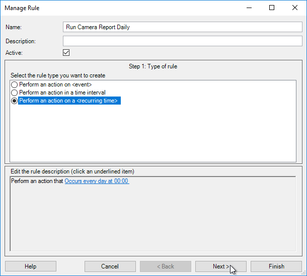
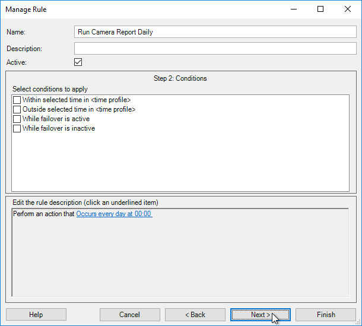
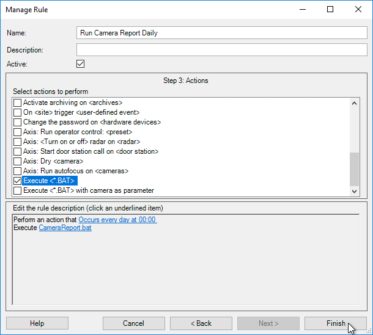

# Automation with Rules

## Overview

The [BatAction plugin](https://github.com/milestonesys/mipsdk-samples-plugin/tree/main/BatAction)
is a "background plugin" which means it runs within the Milestone Event Server
service. It's a MIP plugin sample with source code [available on GitHub](https://github.com/milestonesys/mipsdk-samples-plugin/tree/main/BatAction), and it
demonstrates how a .NET developer can build a plugin which exposes custom
"rule actions". In this case, the custom actions will execute a .BAT file
located within the plugin's "BatFiles" folder with optional arguments.

This guide explains one way you could use this existing, and freely available
sample plugin, to add powerfull new capabilities to your VMS. We can do this by
calling an external PowerShell script from a .BAT file, and within a PowerShell
environment we have access to the MilestonePSTools module, and countless
built-in, and third-party modules.

## Install MilestonePSTools

You may have different plans for the BatAction plugin which do not involve
MilestonePSTools. If so, feel free to move on to the next section. Otherwise,
you will need to have the module installed on the same computer as your
Milestone Event Server service.

Normally this is the same computer as the Management Server service, but in
some environments the Event Server is installed on an independent computer.

Wherever your Event Server is installed, be sure to install MilestonePSTools.
Check out the [installation guide](../getting-started.md#installation) if you haven't done so already.

## Install BatAction

The quick install script below can be run in a PowerShell terminal on the Event
Server computer and it will download a copy of the BatAction plugin, place it
in your `C:\Program Files\VideoOS\MIPPlugins\` directory, place sample
`CameraReport.bat` and `CameraReport.ps1` files in their respective `BatFiles\`
and `Ps1Files` subfolders, and restart your Event Server service.

```powershell linenums="1" title="Quick Install"
Set-ExecutionPolicy RemoteSigned -Scope Process -Force; [System.Net.ServicePointManager]::SecurityProtocol = [System.Net.ServicePointManager]::SecurityProtocol -bor 3072; Invoke-Expression (Invoke-RestMethod 'https://www.milestonepstools.com/scripts/install-bataction.ps1')
```

If you used the quick install script above, you can move on to the next
section. Otherwise, read on to see how to install the plugin by hand.

1. [Download BatAction](https://download.milestonesys.com/mipsdk/bataction_v21.2.zip).
2. Make sure to unblock the ZIP file *before* extracting it.
   - Right-click on the ZIP file and select ***Properties***.
   - If you see a checkbox to unblock the file, check the box and press ***OK***.
3. Extract the files to `C:\Program Files\VideoOS\MIPPlugins`.
   - Check that the plugin.def file is present at `C:\Program Files\VideoOS\MIPPlugins\BatAction\plugin.def`.
4. Restart the Milestone Event Server service

The plugin is now installed and ready to use with a basic `Sample.bat` file. To
see tips on how to add your own scripts, check out the next section.

### Some background on MIP plugins

Milestone plugins are typically loaded from one of two folder locations:

- C:\Program Files\Milestone\MIPPlugins
- C:\Program Files\VideoOS\MIPPlugins

!!! info

    The `VideoOS` folder is OEM-friendly so that in many cases plugins written for
    a Milestone product will also work for products OEM'd from Milestone and
    sold/supported by an OEM partner.

There are three Milestone components that will look for plugins to load during
startup:

1. Management Client
2. XProtect Smart Client
3. Event Server

Each plugin has it's own subfolder in the MIPPlugins folder(s), and in that
folder there is a `plugin.def` file which defines the entrypoint for the plugin
and the environment in which the plugin should be loaded. For example, a plugin
for XProtect Smart Client is not normally loaded by the Event Server.

The plugin definition file for BatAction looks like this:

```xml
<plugin>
   <file name="BatAction.dll"/>
   <load env="Service"/>
</plugin>
```

## CameraReport.bat and CameraReport.ps1

If you installed the BatAction plugin using the quick install script, you
already have the following two files:

- C:\Program Files\VideoOS\MIPPlugins\BatAction\BatFiles\CameraReport.bat
- C:\Program Files\VideoOS\MIPPlugins\BatAction\Ps1Files\CameraReport.ps1

On the surface, it seems like you may be able to get away with just putting PS1
files in the BatFiles folder. The BatAction plugin doesn't care what the file
type is - it will find all files in the folder. However, in practice, it seems
the parameters used with the .NET `ProcessStartInfo` may not always allow you
to successfully launch PowerShell scripts directly with the BatAction plugin.

For this reason, you'll find the CameraReport.bat consists of the following
line. And if you install the plugin manually, feel free to create your own BAT
file with the content below.

```text title="CameraReport.bat"
powershell.exe -ExecutionPolicy Bypass -NoProfile -NonInteractive -NoLogo -File "%~dp0..\Ps1Files\%~n0.ps1" %*
```

This line will use powershell.exe (Windows PowerShell 5.1 x64) to launch a file
with the same name as the .BAT file, but with a .PS1 extension, and in the
`C:\Program Files\VideoOS\MIPPlugins\BatAction\Ps1Files\` folder. All the
arguments passed to the .BAT file will be passed on to the .PS1 file.

The following script is the full contents of the `CameraReport.ps1` file which
features a function you can use to parse the BatAction arguments passed on to
the script, and it demonstrates a rudimentary way to add logging to your script
using the `Start-Transcript` cmdlet.

!!! note

    Restart the Event Server service after making any changes to the `BatFiles\` folder

```powershell linenums="1" title="CameraReport.ps1"
function ConvertFrom-BatActionArgList {
    [CmdletBinding()]
    [OutputType([pscustomobject])]
    param(
        [Parameter()]
        [string[]]
        $ArgumentList
    )

    process {
        $obj = [pscustomobject]@{
            SourceId   = [guid]::Empty
            SourceName = $null
            SourceType = $null
            Devices    = New-Object System.Collections.Generic.List[pscustomobject]
        }

        $index = 0
        if ($ArgumentList.Count -gt 0 -and $null -ne ($ArgumentList[0] -as [guid])) {
            $obj.SourceId = $ArgumentList[0] -as [guid]
            $obj.SourceName = $ArgumentList[1]
            $obj.SourceType = $ArgumentList[2]
            $index = 3
        }

        for (; $index -lt $ArgumentList.Count; $index++) {
            if ($ArgumentList[$index] -match '^Item=(?<id>[0-9a-fA-F\-]{36}) Name=(?<name>.+)$') {
                $obj.Devices.Add([pscustomobject]@{
                    Name = $Matches.name
                    Id   = $Matches.id
                })
            }
            else {
                Write-Error "Format of `$arg[$index] was unexpected. Expected ""Item=<guid> Name=<name>"" but received ""$($ArgumentList[$index])"""
            }
        }

        Write-Output $obj
    }
}

try {
    # Use Start-Transcript to log to C:\ProgramData\Milestone\BatAction\BatAction.log
    # Note: The log file gets re-written on every execution to keep things simple and avoid generating too many logs.
    $workingDir = Join-Path $env:ProgramData 'Milestone\BatAction\'
    $null = New-Item -Path $workingDir -ItemType Directory -Force
    $transactionLogPath = Join-Path $workingDir 'BatAction.log'
    Start-Transcript -Path $transactionLogPath


    <# The $args variable holds all arguments passed to the script. Here, we're calling the function
    above to parse the arguments into something that is easier to use in PowerShell.

    We won't use this object in this example, but you could for instance write a script tha
    uses MilestonePSTools to perform an export of video associated with a bookmark.

    The object returned by ConvertFrom-BatActionArgList looks like...

    [guid]$SourceId (will be [guid]::Empty if the trigger was based on a schedule)
    [string]$SourceName (will be $null if the trigger was based on a schedule)
    [string]$SourceType (will be $null if the trigger was based on a schedule, otherwise usually 'Event' or 'Camera')
    [pscustomobject[]]$Devices (empty array, or a list of pscustomobjects each with a Name and Id property)
    #>
    $BatActionArgs = ConvertFrom-BatActionArgList -ArgumentList $args
    Write-Host "The BatAction plugin provided the following data:`r`n$($BatActionArgs | ConvertTo-Json)`r`n"

    $timestamp = (Get-Date).ToString('yyyy-MM-dd_HH-mm-ss')
    $fileName = "Camera-Report_$timestamp.csv"
    $reportPath = Join-Path -Path $workingDir -ChildPath $fileName

    Write-Host "Connecting to http://localhost as $($env:USERNAME)"
    Connect-Vms -AcceptEula
    Write-Host 'Connected'

    Write-Host "Running Get-VmsCameraReport and saving the results to $reportPath"
    Get-VmsCameraReport -Verbose | Export-Csv -Path $reportPath -NoTypeInformation
    Write-Host 'Done'
}
finally {
    Stop-Transcript
}
```

## Putting BatAction to use

Now that you have the BatAction plugin installed and configured with at least
the `CameraReport.*` samples above, follow these steps to trigger your script.

1. Step 0: Create a new rule in Milestone XProtect Management Client under ***Rules and Events*** and then ***Rules***, and give it a name.
2. Step 1: Select the rule type, "Perform an action on a *<recurring time>*".
3. Step 2: Leave all conditions unselected and click ***Next***.
4. Step 3: Select either the `Execute <*.BAT>` or `Execute <*.BAT> with camera as parameter`
   action and use the hyperlink(s) in the rule description below to fill in the blanks.
5. Click ***Finish***
   The former will execute the .BAT file with no arguments, unless the trigger is  except the  while the latter

### Step 1



### Step 2



### Step 3



## Extending this example

Since PowerShell is such an expansive scripting language, there is no end to
the kind of tasks you could perform by combining the BatAction plugin with
PowerShell. Some ideas we can think of include:

- Automatic, scheduled reports or reports on-demand using User-defined Events.
- Create an export of the video one minute before, and one minute after a
  live bookmark is created.
- Send an HTTP POST using `Invoke-RestMethod` with a JSON object representing
  a camera when Milestone reports a connection error with the camera.

Follow these steps to add your own custom scripts to execute using the
BatAction plugin:

1. Create a copy of `C:\Program Files\VideoOS\MIPPlugins\BatAction\BatFiles\CameraReport.bat` and name it appropriately, with a .BAT extension.
2. Create a copy of `C:\Program Files\VideoOS\MIPPlugins\BatAction\Ps1Files\CameraReport.ps1` and name it the same as the .BAT file, but with a .PS1 extension.
3. Edit your renamed copy of `CameraReport.ps1`, and either replace everything in the script with your own code, or if you prefer to re-use the parameter parsing function and the logging to `C:\ProgramData\Milestone\BatAction`, you can replace everything between `$BatActionArgs = ConvertFrom-BatActionArgList -ArgumentList $args` and `Write-Host 'Done'`.
4. Restart the Milestone Event Server service to detect the new .BAT file.

--8<-- "abbreviations.md"

