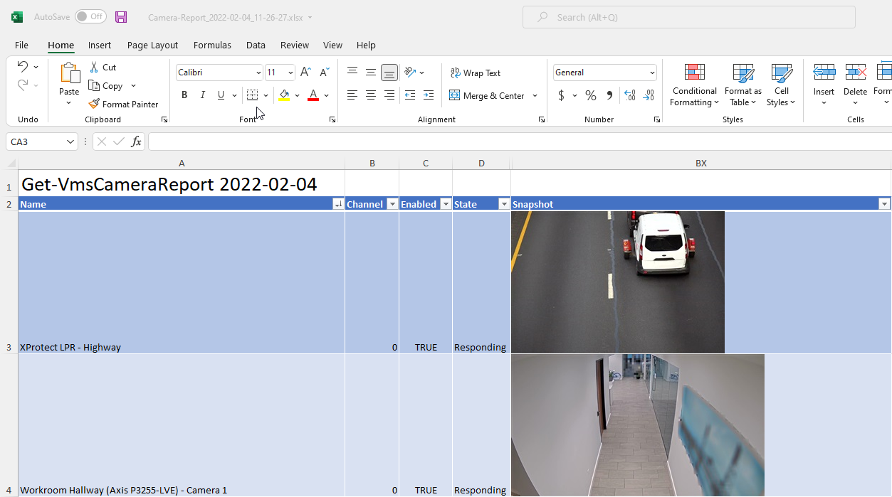

# Working with snapshots

## Introduction

In the context of MilestonePSTools, a snapshot is a JPEG image from a camera
live feed, or previously recorded video.

In this guide you'll learn how to work with snapshots through `Get-Snapshot`,
and `Get-VmsCameraReport`, how to save snapshots to disk, and how to produce
an Excel spreadsheet with embedded images.

To follow along, download the files discussed in this guide and extract the
contents to **C:\demo**.

[Download :material-download:](../scripts/guide-workingwithsnapshots.zip){ .md-button .md-button--primary }

## Retrieving snapshots

Let's begin with an introduction to the `Get-Snapshot` cmdlet. This cmdlet
uses the [JPEGLiveSource](https://doc.developer.milestonesys.com/html/index.html?base=miphelp/class_video_o_s_1_1_platform_1_1_live_1_1_j_p_e_g_live_source.html&tree=tree_search.html?search=videoos.platform.live.jpeglivesource){target="_blank"} and [JPEGVideoSource](https://doc.developer.milestonesys.com/html/index.html?base=miphelp/class_video_o_s_1_1_platform_1_1_data_1_1_j_p_e_g_video_source.html&tree=tree_search.html?search=jpegvideosource){target="_blank"} classes from MIP SDK which can
request video from a recording server in the original video format, and then
convert the feed to JPEG on the client system using hardware acceleration if
available. Because the conversion takes place on the PowerShell side, there's
no extra load on the recording server beyond a normal live or playback request.

Here's what it looks like to request a live image, and a recorded image...

```powershell linenums="1"
Connect-Vms -ShowDialog -AcceptEula
$camera = Select-Camera -SingleSelect # (1)!
$liveSnapshot = $camera | Get-Snapshot -Live
$liveSnapshot

<# OUTPUT (live)
  BeginTime              : 2/2/2022 10:34:23 PM
  EndTime                : 2/2/2022 10:34:23 PM
  Content                : {255, 216, 255, 224...}
  Properties             : {}
  HardwareDecodingStatus : hardwareNvidia
  Width                  : 1920
  Height                 : 1080
  CroppingDefined        : False
  CropX                  : 0
  CropY                  : 0
  CropWidth              : 1
  CropHeight             : 1
  CustomData             :
#>


$recordedSnapshot = $camera | Get-Snapshot -Timestamp (Get-Date).AddHours(-2)
$recordedSnapshot

<# OUTPUT (recorded)
  HardwareDecodingStatus : hardwareNvidia
  Width                  : 1920
  Height                 : 1080
  CroppingDefined        : False
  CropX                  : 0
  CropY                  : 0
  CropWidth              : 1
  CropHeight             : 1
  CustomData             :
  DateTime               : 2/2/2022 10:14:07 PM
  Bytes                  : {255, 216, 255, 224...}
  IsNextAvailable        : True
  NextDateTime           : 2/2/2022 10:14:07 PM
  IsPreviousAvailable    : True
  PreviousDateTime       : 2/2/2022 10:05:42 PM
#>
```

1. `Select-Camera` is a useful camera selection tool when working with
   PowerShell interactively. You would not want to use Select-Camera in an
   automated script as it requires user-interaction.

The response from `Get-Snapshot` is a [VideoOS.Platform.Live.LiveSourceContent](https://doc.developer.milestonesys.com/html/index.html?base=miphelp/class_video_o_s_1_1_platform_1_1_live_1_1_live_source_content.html&tree=tree_search.html?search=videoos.platform.live.livesourcecontent){target="_blank"} object when requesting a live image,
or a [VideoOS.Platform.Data.JPEGData](https://doc.developer.milestonesys.com/html/index.html?base=miphelp/class_video_o_s_1_1_platform_1_1_data_1_1_j_p_e_g_data.html&tree=tree_search.html?search=jpegdata){target="_blank"}
object when requesting a previously recorded image.

These objects provide image dimensions, hardware acceleration status, timestamps,
and in the case of a recorded image, you also get information about the previous,
and next images available.

Once you have one of these objects, you can access the JPEG as a byte array named
**Content** or **Bytes** depending on whether the snapshot is from the live
feed, or a recorded image from the media database.

## Saving images

The `[byte[]]` value of the **Content** or **Bytes** properties can be written
directly to disk or used in memory however you like. Here's how you could save
those byte arrays to disk as .JPG files...

```powershell linenums="1"
$null = mkdir C:\demo\ -Force
[io.file]::WriteAllBytes('c:\demo\liveSnapshot.jpg', $liveSnapshot.Content)
Invoke-Item 'C:\demo\liveSnapshot.jpg'

[io.file]::WriteAllBytes('c:\demo\recordedSnapshot.jpg', $recordedSnapshot.Bytes)
Invoke-Item 'C:\demo\recordedSnapshot.jpg'
```

There's an easier way to save these snapshots as files though. All you need to
do is use the `-Save` switch, with a path to a folder where the snapshots should
be stored...

```powershell linenums="1"
$null = $camera | Get-Snapshot -Live -Save -Path C:\demo\ -UseFriendlyName # (1)!
Get-ChildItem C:\Demo

<# OUTPUT
  Directory: C:\demo

  Mode    LastWriteTime       Length Name
  ----    -------------       ------ ----
  -a----  2/2/2022   2:57 PM  292599 Cam Lab Camera_2022-02-02_22-57-24.445.jpg
#>
```

1. The `Get-Snapshot` cmdlet will still return data to PowerShell even if you
   save the image to disk, so by assigning the response to `$null` we can
   suppress the output when we don't need it.

A fixed file name can be specified for each snapshot by providing a value for
the `-FileName` parameter. Otherwise a file will be created in the folder
specified by `-Path` with either the camera ID, or the camera name, followed by
a timestamp either in UTC, or in the local time zone when the `-LocalTimeStamp`
switch is present.

!!! note

    When saving a snapshot using the `-UseFriendlyName` switch, the camera name
    will be used in the file name. If there are any characters in the camera
    name that are invalid for Windows file names, they'll be replaced with a
    dash (-) character.

## Create Excel Documents

The [ImportExcel PowerShell module](https://github.com/dfinke/ImportExcel){target="_blank"} makes it easy to read and write data in Excel
documents, even without Excel installed on the same computer. And with a little
extra work, we can embed images into those documents.



Installing ImportExcel is similar to installing any other PowerShell module
hosted on PowerShell Gallery: `Install-Module -Name ImportExcel`.

In this part of the guide, we'll introduce a helper function for adding images
to an Excel document created using ImportExcel, and then we'll show how to use
it to embed snapshots from `Get-VmsCameraReport` as well as generate a report
on closed alarms with images.

!!! tip

    To follow along, click the "Download" button at the top of the guide and
    extract to a folder at **C:\demo**.

### Function: Add-ExcelImage

There are no built-in cmdlets in ImportExcel (yet) for adding images to an Excel
document. The following function demonstrates how this can be done using
methods from the underlying EPPlus library and you're welcome to reuse this by
adding it to the top of your script or you can save in it's own file and
dot-source it from your script as we'll show later on.

```powershell linenums="1" title="C:\demo\Add-ExcelImage.ps1"
--8<-- "scripts/add-excelimage.ps1"
```

### Function: Export-ExcelCustom

The following function will be used to export collections of data, including
`System.Drawing.Image` objects. It offers a flexible way to produce
a styled Excel table from a data set, with support for images. Soon we'll
demonstrate how to use this with the built-in `Get-VmsCameraReport` cmdlet.

!!! warning

    This function does not support streaming data from the pipeline. That means
    all rows of data must be in memory all at once, images included. If your report
    has many thousands of rows, it's possible that this function will not work
    for you.

```powershell linenums="1" title="C:\demo\Export-ExcelCustom.ps1"
--8<-- "scripts/export-excelcustom.ps1"
```

### Example 1 - Get-VmsCameraReport

With these two functions available in our scripts folder at **C:\demo**, or
wherever you decide to run them from, we'll use the following script which
dot-sources the functions we need, connects to the Management Server, and
exports a camera report with snapshots to an Excel spreadsheet. Run this script
from PowerShell, and if you have Excel installed, the report will be opened upon completion.

```powershell linenums="1" title="C:\demo\SaveCameraReport.ps1"
--8<-- "scripts/savecamerareport.ps1"
```

### Example 2 - Get-VmsAlarmReport

The `Get-VmsAlarmReport` function below was originally designed as a simple
CSV report to list recently closed alarms with the operator, reason codes, and
notes. The function is built *using* MilestonePSTools, but is not built-in
because it's a very opinionated idea of how you might want to pull information
out of Milestone. Rather than maintain it as part of MilestonePSTools, it is
offered as an example for you to use as-is or modify to suit your needs.

```powershell linenums="1" title="C:\demo\Get-VmsAlarmReport.ps1"
--8<-- "scripts/get-vmsalarmreport.ps1"
```

Using the `Get-VmsAlarmReport` function defined above, this example will
produce a report of all closed alarms that were modified in the last 24 hours.
A snapshot is retrieved for each alarm with a related camera, and the results
are sent to an Excel document.

```powershell linenums="1" title="C:\demo\SaveAlarmReport.ps1"
--8<-- "scripts/savealarmreport.ps1"
```

## Conclusion

The ImportExcel module is an extremely powerful tool for working with Excel in
PowerShell, and this guide only touches the surface. If you need to do more
advanced work importing or exporting Excel data, check out the [ImportExcel GitHub repository](https://github.com/dfinke/ImportExcel){target="_blank"}
where the owner, Doug Finke, has provided great documentation and Examples.

