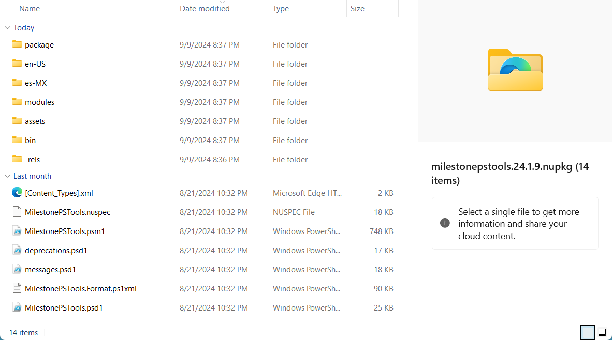
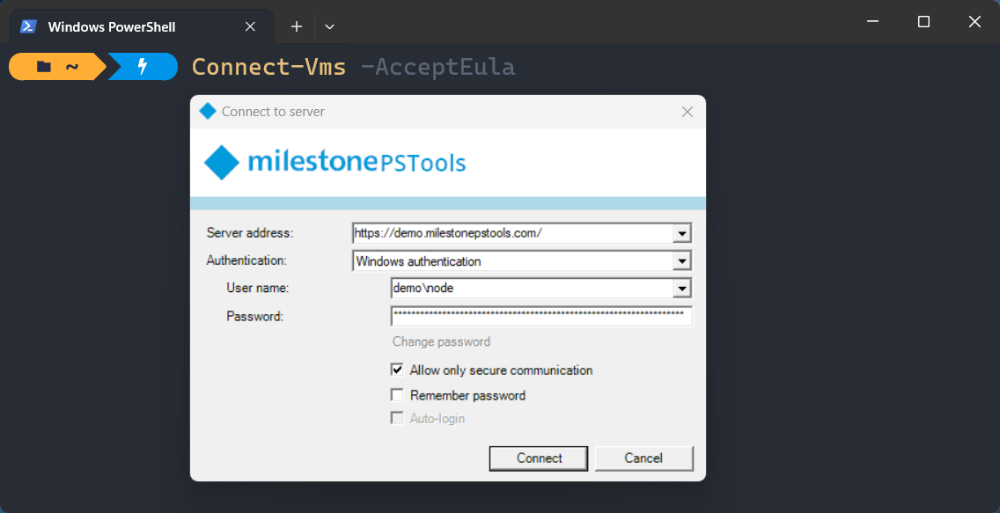
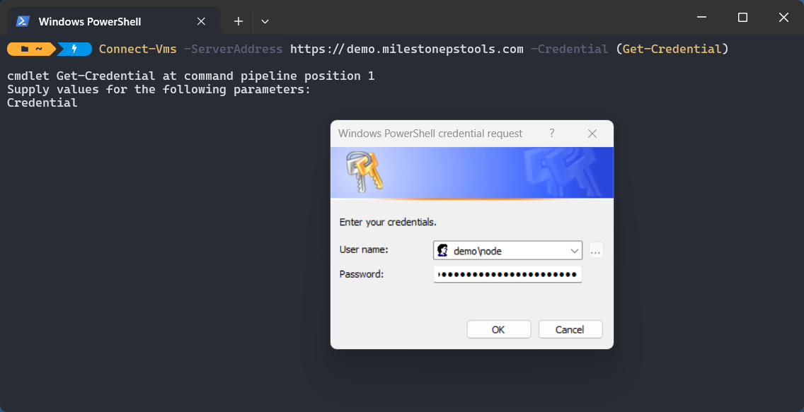
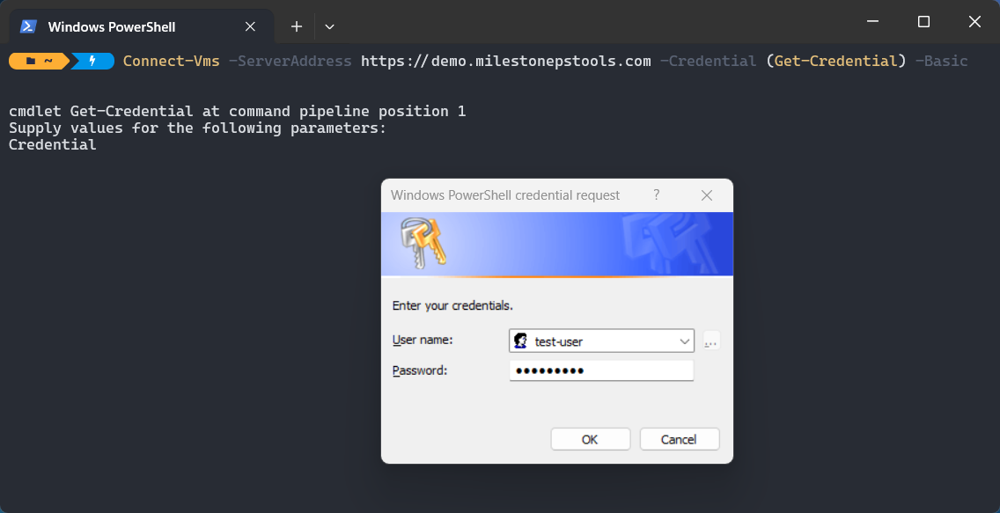

---
hide:
  - navigation
---

# Getting started

## Requirements

- [x] Any _supported_ Milestone XProtect VMS product and version. See [Compatibility](./help/compatibility.md).
- [x] Windows PowerShell 5.1.
- [x] .NET Framework 4.7.2 or later.

??? info

    - Some features in MilestonePSTools rely on specific VMS editions. For example, creating evidence locks requires
      that you are connected to Milestone XProtect Corporate.
    - Some MilestonePSTools features _may_ work on XProtect versions as old as 2014. However, our priority is to
      ensure compatibility with supported XProtect versions which typically includes all versions released in the last 3
      years.
    - To check your PowerShell version, open PowerShell and type `$PSVersionTable`.
      The PSVersion value is your PowerShell version.
    - If you have an earlier version of PowerShell, you may need to install
        [Windows Management Framework 5.1](https://www.microsoft.com/en-us/download/details.aspx?id=54616).
    - MilestonePSTools cannot be used on PowerShell Core or PowerShell 7+. However, if you use a newer version of
      PowerShell for other tasks, you can still use Windows PowerShell 5.1 on the same computer providing it is a Windows
      operating system.

## Installation

### :fontawesome-solid-users: All users

```powershell linenums="1"
Install-Module MilestonePSTools # (1)!
```

1. Requires Administrator privileges and installs the module to the `C:\Program Files\WindowsPowerShell\Modules` directory.

### :fontawesome-solid-user: Current user

```powershell linenums="1"
Install-Module MilestonePSTools -Scope CurrentUser # (1)!
```

1. Installs the module to `Documents\WindowsPowerShell\Modules` for the current user.

### :material-run-fast: Quick Install

There are a few common errors you may see when installing or using a PowerShell module for the first time on some
Windows versions. The following quick-install script attempts to address these automatically for a quick and easy
installation on an internet-connected system. It will download and run [install.ps1](https://www.milestonepstools.com/install.ps1),
and as with any script on the Internet, we encourage you to inspect it and understand what it does before you copy and
paste anything into a PowerShell terminal.

```powershell linenums="1" title="Quick Install"
--8<-- "bootstrap.ps1"
```

!!! tip

    MilestonePSTools does **not** need to be installed on the Milestone XProtect
    Management Server. Nearly every command in the module is designed to connect
    to your VMS the same way XProtect Smart Client and Management Client do.

### :material-wrench: Manual

Follow the steps below if you do not have internet access on the computer where MilestonePSTools will be used.

First, try using the `Save-Module` PowerShell command on an internet-connected Windows computer. If this works for you,
you can skip ahead to [step 3](#step-3-copy-to-the-destination).

```powershell
Save-Module MilestonePSTools -Path C:\temp # (1)!
```

1. Make sure to create the `C:\temp` directory first, or use a path to a folder that already exists.

#### Step 1: Download the raw nupkg file

Visit [PowerShell Gallery](https://www.powershellgallery.com/packages/MilestonePSTools)
and click **Manual Download** under **Installation Options**, then click
**Download the raw nupkg file**.

#### Step 2: Extract the contents

Nupkg files are actually ZIP files. Add the `.zip` extension to the file you
downloaded and you can view/extract the contents. Here's what the contents look like for MilestonePSTools...



!!! tip

    Before you extract the ZIP file, make sure to right-click on it and open **Properties**. If you see a checkbox to
    "unblock" the files, you should do this before extracting them. Otherwise each individual extracted file will need
    to be unblocked later.

    A quick way to unblock all files under a directory is to use...

    ```powershell
    Get-ChildItem path/to/directory -File -Recurse | Unblock-File
    ```

#### Step 3: Copy to the destination

After you extract the files for the module, the best place to put them is in one of the locations PowerShell
_automatically_ looks for PowerShell modules. If you install the module for _just you_, then you should place the module
in your Documents directory under `Documents\WindowsPowerShell\Modules`. If the folder(s) do not exist, you may create
them.

Alternatively if you want to make the module available to any user on the local machine you can place them in
`C:\Program Files\WindowsPowerShell\Modules`.

!!! tip

    To see where Windows PowerShell will look to auto-import modules in your environment, type

    ```powershell
    $env:PSModulePath -split ';'
    ```

The structure for the Modules folder is that the first level includes a folder matching the name of the module, and the
subfolder contains one or more versions of that module where the name of the folder matches the exact version of the
module as defined in the `*.psd1` file inside that folder.

In the example below, we have MilestonePSTools version 24.1.9, and inside that folder are the contents from the
screenshot above.

```text
Modules/
|---MilestonePSTools/
|   |---24.1.9/
|       |---MilestonePSTools.psd1
```

Once you have the modules extracted and placed in the right location, you should be able to run
`Import-Module MilestonePSTools` and it will be loaded into your PowerShell session. If you get an error message, check
out [this blog post](blog/posts/common-errors.md) to see if we've already shared some tips on how to handle it.

## Usage

There are over 270 commands in this module and a wide variety of tasks you may like to automate. Here are a few commands
to help get you started. See the [command index](commands/en-US/index.md) for a list of available commands, or run
`Get-Command -Module MilestonePSTools` to show a list of commands in your PowerShell terminal.

!!! note

    All `Get-` commands are safe to use and will not change the state of your XProtect VMS. Most commands which do
    change state in a potentially destructive way include support for the `-WhatIf` parameter which does not _normally_
    result in actually performing that action. Commands like `Remove-VmsHardware` which, by design, will result in the
    loss of video, usually require manual confirmation from the user by default.

### Get connected

=== "Login dialog"
    ```powershell linenums="1"
    Connect-Vms -AcceptEula # (1)!

    # Or...
    
    Connect-Vms -ShowDialog -AcceptEula # (2)!
    ```
    
    1. Connecting without specifying `-ShowDialog` or `-ServerAddress` will automatically log you into the `default`
       connection profile, or prompt you with a login dialog and save those credentials to re-use in the future.
    2. Using `-ShowDialog` will always bring up an interactive login dialog, and the login information will not be
       saved for later use.

    

=== "Login with Windows User"
    ```powershell linenums="1"
    Connect-Vms -ServerAddress http://localhost -Credential (Get-Credential)
    ```
    
    

=== "Login with Basic User"
    ```powershell linenums="1"
    Connect-Vms -ServerAddress http://localhost -Credential (Get-Credential) -BasicUser
    ```
    
    

!!! note
    The `-AcceptEula` switch is required only the first time you use `Connect-Vms` or `Connect-ManagementServer`. After
    that, a flag is set in `%appdata%\MilestonePSTools`.

### List all enabled cameras

```powershell
Get-VmsCamera # (1)!
```

1. If you want to retrieve _all cameras_ and not only the enabled ones, use `Get-VmsCamera -EnableFilter All`.

### Save a camera report to a CSV file

```powershell
Get-VmsCameraReport -Verbose | Export-Csv cameras.csv
```

### Export hardware to Excel

```powershell
Export-VmsHardware hardware.xlsx # (1)!
```

1. Microsoft Excel does _not_ need to be installed to export or import using an `.xlsx` file. However, you may also
   like to export hardware to a more simple CSV file, and that can be done with the same command - just use a `.csv`
   extension instead of `.xlsx`.

### Import hardware configuration changes

```powershell
Import-VmsHardware hardware.xlsx -UpdateExisting -Verbose
```

--8<-- "abbreviations.md"

