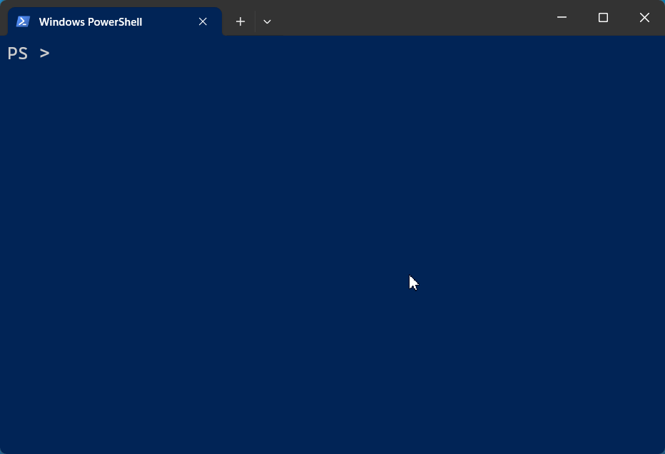

# **Manage XProtect^®^ at <ins>ANY scale</ins>.**
Configure. Automate. Report. _You decide_ what is possible on the Open Platform.
    

[Install-Module](getting-started.md#installation){ .md-button .md-button--primary }
  
_Compatible with all supported versions of XProtect._

## What does it do?

-   :fontawesome-solid-file-import:{ .lg .middle } __Import cameras__

    ---

    Quickly add or update cameras and other hardware by importing a CSV or XLSX file

    [:octicons-arrow-right-24: Docs](./commands/en-US/Import-VmsHardware.md)

-   :material-database-export:{ .lg .middle } __Export video__

    ---

    Export video in MKV or native XProtect format, and save snapshots

    [:octicons-arrow-right-24: Docs](commands/en-US/Start-Export.md)

-   :material-file-document-check:{ .lg .middle } __Audit configuration__

    ---

    Quickly verify your entire VMS is configured according to your requirements, and that you're meeting video retention
    expectations

    [:octicons-arrow-right-24: Reports](commands/en-US/Get-VmsCameraReport.md)

-   :material-certificate-outline:{ .lg .middle } __Certificate rotation__

    ---

    Save time and avoid service interruptions by automating certificate updates on your management servers and recording
    servers

    [:octicons-arrow-right-24: Docs](commands/en-US/Set-XProtectCertificate.md)

-   :material-account-cog:{ .lg .middle } __Manage roles__

    ---

    Add, remove, and inspect roles, role membership, and permissions

    [:octicons-arrow-right-24: Docs](commands/en-US/Add-VmsRoleMember.md)

-   :fontawesome-solid-code:{ :target="_blank" .lg .middle } __Based on the MIP SDK__

    ---

    Leverage all the capabilities of the Milestone Integration Platform from PowerShell without learning C#

    [:octicons-arrow-right-24: MIP SDK](https://doc.developer.milestonesys.com/)

--8<-- "telemetry.md.template"

--8<-- "abbreviations.md"

